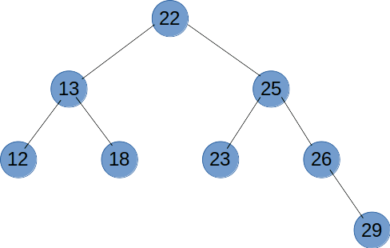

## 手写冒泡算法
```js
function bubbleSort(arr) {
  const len = arr.length;
  for (let i = 0; i < len; i++) {
    // 每次排序一轮，就排序好一个元素
    for(let j = 0; j < len - i - 1; j++) {
      if (arr[j] > arr[j + 1]) {
        const temp = arr[j];
        arr[j] = arr[j + 1];
        arr[j + 1] = temp;
      }
    }
  }
}
```


## 根据 value 获取叶子节点
```js
/**
 * 获取树节点
 * @param {Array} tree 树结构
 * @param {*} value 要找的节点值
 * @param {String} keyName 要找的节点键名
 * @param {String} childrenKey 当前节点中子节点键名
 */
export function getTreeNode(tree, value, keyName, childrenKey) {
  const stack = [...tree];
  let tempNode;

  while (stack.length) {
    tempNode = stack.pop();
    if (tempNode[keyName] === value) {
      return tempNode
    }
    if (tempNode[childrenKey] && tempNode[childrenKey].length) {
      stack.push(...tempNode[keyName]);
    }
  }

  return null;
}
```


## 根据 value 获取叶子节点的路径
```js
/**
 * 根据 value 获取叶子节点的路径
 * @param {Array} tree
 * @param {*} value
 * @param {String} keyName
 * @param {String} childrenKey
 */
export function getTreeKeyPath(tree, value, keyName, childrenKey = 'children') {
  const path = [];

  const parse = (subTree) => {
    for (let i = 0; i < subTree.length; i += 1) {
      const node = subTree[i];
      path.push(node[keyName]);
      if (node[keyName] === value) {
        return true;
      }
      if (node[childrenKey] && node[childrenKey].length) {
        if (parse(node[childrenKey])) {
          return true;
        }
      }
      path.pop();
    }
    return false;
  };

  parse(tree);

  return path;
}
```


## 列表结构转树结构
### 递归
使用该方法虽然易懂，但是当 source 列表比较大的时候性能会比较差。
```js
export function listToTree(source, pid = 0) {
  const list = JSON.parse(JSON.stringify(source)); // 避免影响之前的数组
  const result = [];

  list.forEach(item => {
    if (item.parentId === pid) {
      item.children = listToTree(source, item.id);
      result.push(item);
    }
  });

  return result;
}
```
### 循环
该方法比上面的递归性能更好。
```js
export function listToTree(source, rootId = 0) {
  const list = JSON.parse(JSON.stringify(source)); // 避免影响之前的数组
  const map = new Map();
  const result = [];

  list.forEach((item) => {
    // 如果父节点在后面出现，需要合并 children 属性
    item = { ...item, ...map.get(item.id) };
    map.set(item.id, item);

    if (item.id === rootId) {
      result.push(item);
    } else {
      const parentItem = map.get(item.parentId) || {};
      if (!parentItem.children) {
        parentItem.children = [];
      }
      parentItem.children.push(item);
      map.set(item.parentId, parentItem);
    }
  });
  
  return result;
}
```


## 实现洗牌算法
```js
// 返回最小与最大值之间的随机数，包含最大最小值
function getRandomInt(min, max) {
  return Math.floor(Math.random() * (max - min + 1) + min);
}

//将数组的副本循环随机打乱重组一个新数组返回
//实现方法: 在[0~i]数组中,取出i的值,将他的值与随机一个小于i索引的值对换
export function shuffle(arr) {
  let _arr = arr.slice();

  for (let i = 0; i < _arr.length; i++) {
    let j = getRandomInt(0, i);
    let t = _arr[i];
    _arr[i] = _arr[j];
    _arr[j] = t;
  }

  return _arr;
}
```


## 二叉树遍历(前序、中序、后序、广度优先)
### 前序遍历
前序遍历是先输出节点的值，再递归遍历左右子树，前序遍历是一个深度优先的遍历方法。
```js
function recursionTreeNode(root) {
  if (root != null) {
    console.log(root.val);
    recursionTreeNode(root.left);
    recursionTreeNode(root.right);
  }
}
```

### 中序遍历
中序遍历是先遍历左子树，再输出当前节点，最后遍历右子树。
```js
function recursionTreeNode(root) {
  if (root != null) {
    recursionTreeNode(root.left);
    console.log(root.val);
    recursionTreeNode(root.right);
  }
}
```

### 后序遍历
后序遍历是先递归遍历左右子树，再输出节点的值。
```js
function recursionTreeNode(root) {
  if (root != null) {
    recursionTreeNode(root.left);
    recursionTreeNode(root.right);
    console.log(root.val);
  }
}
```

### 广度优先遍历
广度优先遍历就是按树的深度，从根节点开始，一层一层向底部遍历。
```js
function recursionTreeNode(root) {
  const stack = [root];

  while (stack.length) {
    let tempNode = stack.pop();
    console.log(tempNode.val)

    if (tempNode.children.length) {
      stack.push(...tempNode.children);
    }
  }

  return null;
}
```
