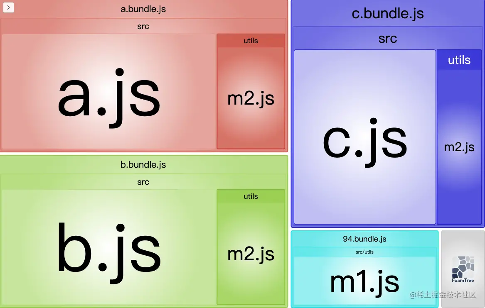
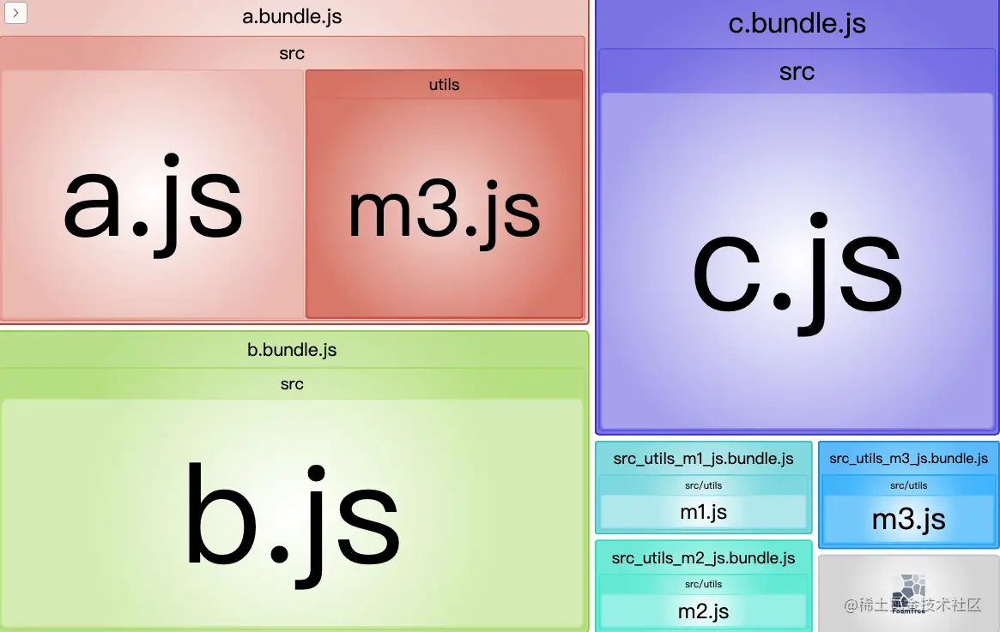
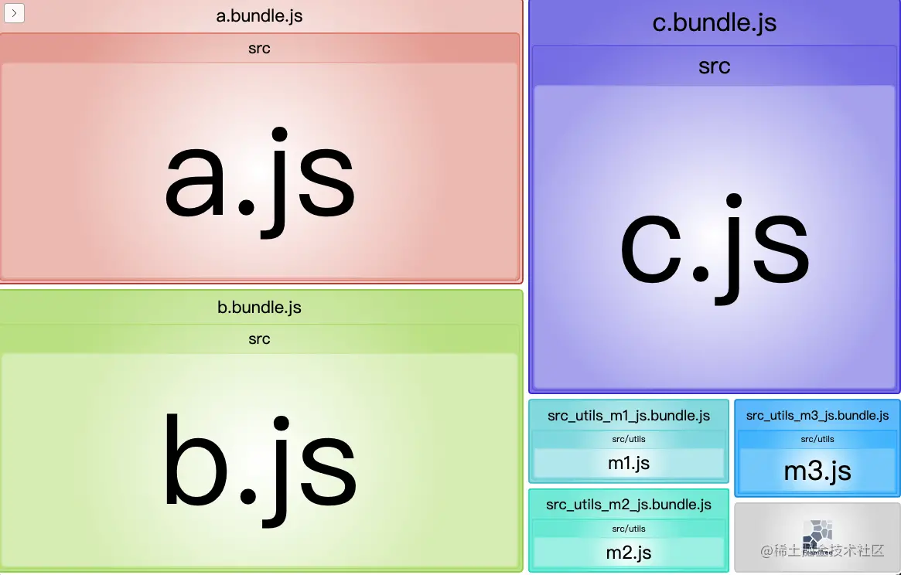

## webpack Loader 的加载顺序
webpack 的 Loader 加载是从右往左依次加载的，例如：
```js
{
  test: /\.less$/,
  use: ['style-loader', 'css-loader', 'less-loader']
}
```
至于为啥 Webpack 选择从右往左加载，只是 Webpack 选择了 compose（从右往左组合函数） 方式，而不是 pipe（从左向右组合函数） 的方式而已，在技术上实现从左往右也不会有难度。


## webpack 中 hash、chunkhash、contenthash 有什么不同？
### hash
hash 计算是跟整个项目的构建相关，只要在打包的过程中有一处变化了，就会生产一个新的 hash 值。不要在生产环境使用，因为修改一个文件后，所有的 chunk 的名称都变了，不利于缓存。
### chunkhash
chunkhash 是根据打包的 chunk（就是打包后的文件） 来生成对应的 hash 值。如果使用 chunkhash 作为文件名称，改变一个文件内容后，只有对应的 chunk 文件名称会改变，这样会比较好的利用缓存。但有一个问题，现代前端框架会把 js 和 css 放在一个文件里，比如像 vue 这些框架，我们一般会用一个插件叫 mini-css-extract-plugin，这样我们就能把 css 单独打包，但是这样就会产生一个问题，这样打包出来的 css 的 chunkhash 和 js 的 chunkhash 会是一样的，这样当我们 js 文件改变后，即使 css 文件内容没有改变，打包出来的 css 文件的 hash 值仍然会改变，不利于缓存。
### contenthash
contenthash 将根据资源内容创建出唯一 hash，也就是说文件内容不变，hash 就不变。我们将 css 文件的名称和 js 文件的名称与 contenthash 关联，就能解决上面 chunkhash 的问题。

### 总结
+ production  
只需要 contenthash 就可以了，修改哪个文件才改变哪个文件的 hash。其它的 hash 不变可以继续从缓存里读取，以加快访问速度。
+ development  
不需要 hash 直接展示名称，毕竟生成 hash 也需要消耗一定资源，cache 还会影响开发体验。

参考资料：[https://github.com/laihuamin/JS-total/issues/19](https://github.com/laihuamin/JS-total/issues/19)


## 聊聊 webpack 的 tree-shaking  
### 开启步骤
1. 关闭 babel 的模块语法转换  
在 @babel/preset-env 配置中 modules 设置为 false，这样 babel 就不会将我们写的 es6 Module 的导入方式进行转换（tree-shaking 依赖 es6 的 Module 语法）
2. 设置 mode 为 production
3. 确保 usedExports 为 true（默认为 true）
4. 必要的情况下指定 sideEffects
### usedExports
当 usedExports 的配置为 true 时，webpack 会去检测语法中的副作用，并会在压缩代码的时候删除：导入了但没有使用的无副作用的代码。此外在遇到 `/*#__PURE__*/` 注释时也会认为该标记代码是无副作用的。babel 转换 js 的时候，对于**没有副作用**的函数，会在它**调用的地方**会标记为 `/*#__PURE__*/`。
### sideEffects
虽然 usedExports 可以自动去除无副作用的代码，但是大部分代码 webpack 是没法判断是否有副作用的。所以 webpack 提供了 sideEffects 字段，通过手动指定 package.json 中的 sideEffects 来标记哪些代码有副作用，当为 false 时则认为所有代码都是无副作用的，则 webpack 会移除所有未使用的代码。需要注意的是 webpack 去打包你引入的包的时候会查看该包的 package.json 中的 sideEffects 字段，而非你自己项目里的 sideEffects。所以说自己项目配置的 sideEffects 只是指定你自己写的代码是否有副作用，最后 sideEffects 在不配置的情况下默认会认为你写的代码都是有副作用的（保守安全考虑）。
### tree shaking的常见误区
#### 包含副作用的代码，不能配置 sideEffects
sideEffects 实际和代码里是否具有副作用无关，而是该副作用设计是作用在模块内还是模块外，如 vue 代码，虽然有副作用，但是这些副作用是给 vue 的内部实现使用的，而非给外部用的，所以也可以配置 sideEffects 为 false。
#### 为 css 配置 sideEffects: false
为了实现 css 的 tree shaking，想通过配置 css 的 sideEffects 来实现 css 的 tree shaking，结果导致业务直接 import css 的 css 没有打包进来，css 的 tree shaking 应该跟着相关组件走，如果改组件配置了sideEffects: false，当没引入改组件的时候，其 css 会自动跟随 tree shaking 掉。
### tree shaking问题排查方式
1. 确定是 DCE（去除死代码的术语，例如删除 tree shaking 阶段标记的 `/*#__PURE__*/` 代码，一般由压缩工具实现）问题还是 tree shaking 问题，根据代码出现在 top-level 还是非 top-level，我们能比较容易的区分是 tree shaking 失效还是 DCE 失效。如果是函数内的优化失败那么肯定是 DCE，如果是 top-level 的优化失效，则大概率是 tree shaking 失效(也可能是 DCE 失效，如 top level 的 constant folding)。
2. 如果是 DCE 失效，那么很可能是 terser|esbuild 的优化级别过低，或者 terser 没有开启某些优化，请检查 terser 相关配置参数，适当的调整 terser 的 [passes](https://github.com/terser/terser#compress-options) 级别。
3. 如果是 tree shaking 失败，先确认失效模块的路径信息，很多编译工具编译中会保留模块信息(通常需要先关闭 minify，因为 minify 有时会删除掉模块信息)，如 esbuild。
4. 确认了模块路径信息，进一步确认该模块是否具有副作用以及是否为 esModule，有时候是否具有副作用难以判定，可以尝试配置该模块的路径的 sideEffects: false，然后对比配置前后的产物大小是否具有差异，不是所有的模块都应该配置 sideEffects，请先确保改模块是否具有模块内部副作用性质，避免影响了程序的正确性。
5. 如果配置了 sideEffects: false，大小仍然没有明显改变，此时存在两种可能：1. 该模块本身就不能 tree shaking，在其他地方存在着对该模块变量的引用，导致了该模块没被  shaking 掉，这一般通过编辑器的 go to reference 或者自己字符串搜索能查到引用的地方。2. 编译工具存在 bug，如不支持 sideEffects，或者 sideEffects 计算错误，请联系编译工具的开发进行协助排查。
### 最佳实践
1. 关闭 babel 的 modules 转换，以开启 tree-shaking
2. 生产环境指定 mode 为 production
3. 选取 package.json 中 sideEffects 为 false 的包，帮助 webpack tree-shaking
4. 在必要的情况下指定 package.json 中的 sideEffects 字段，用来标记有副作用的代码，帮助 webpack tree-shaking

参考链接：  
+ [Webpack 实现 Tree shaking 的前世今生](https://juejin.cn/post/6978648939012554765)
+ [tree shaking问题排查指南](https://zhuanlan.zhihu.com/p/491391823)
+ [你的Tree-Shaking并没什么卵用](https://zhuanlan.zhihu.com/p/32831172)


## webpack 的 sideEffects 字段应该怎么用
当别人使用你开发的包时，webpack 能够使用 tree-shaking 的前提是你提供了 ESM 格式的代码（package.json 中提供了 module 字段，并且使用方采用 import 语法导入你的包），而 package.json 文件的 sideEffects 字段是用来标记哪些文件是 side-effect-free（无副作用）（注意，一旦标记为无副作用，并且使用方未使用你导出的变量，那么即使你代码中有副作用代码，webpack 也会 tree-shaking 掉），所以说只要你的包不是用来做 polyfill 或 shim 之类的事情，就尽管放心的给他加上。

参考链接：[Webpack 中的 sideEffects 到底该怎么用](https://zhuanlan.zhihu.com/p/40052192)


## 实现一个 webpack loader 和 webpack plugin
### loader 的实现
loader 其实是一个函数，它的参数是匹配文件的源码，返回结果是处理后的源码。例如以下 loader 是将 var 关键词替换为 const：
```js
module.exports = function (source) {
  return source.replace(/var/g, 'const')
}
```
loader 还可以是异步的，如下：
```js
module.exports = function (source) {
  const callback = this.async()

  // 由于有 3 秒延迟，所以打包时需要 3+ 秒的时间
  setTimeout(() => {
    callback(null, `${source.replace(/;/g, '')}`)
  }, 3000)
}
```
### plugin
webpack 在整个编译周期中会触发很多不同的事件，plugin 可以监听这些事件，并且可以调用 webpack 的 API 对输出资源进行处理。这是它和 loader 的不同之处，loader 一般只能对源文件代码进行转换，而 plugin 可以做得更多。webpack 官网定义的插件由以下几个部分构成：
1. 一个 JavaScript 命名函数。
2. 在插件函数的 prototype 上定义一个 apply 方法。
3. 指定一个绑定到 webpack 自身的事件钩子。
4. 处理 webpack 内部实例的特定数据。
5. 功能完成后调用 webpack 提供的回调。

简单的说，一个具有 apply 方法的函数就是一个插件，并且它要监听 webpack 的某个事件。下面来看一个简单的示例：
```js
function Plugin(options) {}

Plugin.prototype.apply = function (compiler) {
  // 所有文件资源都被 loader 处理后触发这个事件
  compiler.plugin('emit', function (compilation, callback) {
    // 功能完成后调用 webpack 提供的回调
    console.log('Hello World')
    callback()
  })
}

module.exports = Plugin
```
关于 compilation 对象：
> compilation 对象代表了一次资源版本构建。当运行 webpack 开发环境中间件时，每当检测到一个文件变化，就会创建一个新的 compilation，从而生成一组新的编译资源。一个 compilation 对象表现了当前的模块资源、编译生成资源、变化的文件、以及被跟踪依赖的状态信息。compilation 对象也提供了很多关键时机的回调，以供插件做自定义处理时选择使用。

参考链接：[https://github.com/woai3c/Front-end-articles/issues/6](https://github.com/woai3c/Front-end-articles/issues/6)


## webpack 打包后代码里的 `__esModule` 和 `__PURE__` 是用来干嘛的
1. `__esModule`  
`__esModule` 是为了解决 CJS 和 ESM 互转的问题，标记该代码是由 ESM 打包成 CJS 的，详见：[CJS和ESM的来龙去脉](https://github.com/NameWjp/blog/issues/54)
2. `__PURE__`  
babel 的转换或 webpack 的 tree-shaking 过程中会使用 `__PURE__` 标记没有副作的代码（目前只支持在调用的地方标记），在后续的压缩中会忽略：导入但没使用，并且标记为 `__PURE__` 的代码，当然也可以手动添加 `__PURE__` 注解，详见：[聊聊 webpack 的 tree-shaking](#聊聊-webpack-的-tree-shaking)  。未来可能支持 `__NO_SIDE_EFFECTS__` 来在函数定义的地方标记其无副作用，详见：[feat: support `#__NO_SIDE_EFFECTS__` annotation for function declaration](https://github.com/rollup/rollup/pull/5024)


## webpack splitChunks 如何使用
splitChunks 是 webpack 用来分包的一个配置，主要有下面一些重要的字段
### chunks
splitChunks.chunks 的作用是指示采用什么样的方式来优化分离 chunks，常用的有三种常用的取值：async、initial 和 all，async 是默认值。
#### async
chunks: 'async' 的意思是只选择通过 import() 异步加载的模块来分离 chunks。例如：
```js
// a.js
import('./utils/m1');
import './utils/m2';

console.log('some code in a.js');

// b.js
import('./utils/m1');
import './utils/m2';

console.log('some code in a.js');

// c.js
import('./utils/m1');
import './utils/m2';

console.log('some code in c.js');
```
打包结果如下：

#### initial
chunks: 'initial' 表示同步导入的模块也会被分离，但是一个模块同时被同步导入，同时被异步导入，则不能复用。例如：
```js
// a.js
import('./utils/m1');
import './utils/m2';
import './utils/m3'; // 新加的。

console.log('some code in a.js');

// b.js
import('./utils/m1');
import './utils/m2';
import('./utils/m3'); // 新加的。

console.log('some code in a.js');

// c.js
import('./utils/m1');
import './utils/m2';

console.log('some code in c.js');
```
打包结果如下：

#### all
chunks: 'all' 表示同步和异步代码都复用。例如：
```js
// a.js
import('./utils/m1');
import './utils/m2';
import './utils/m3'; // 新加的。

console.log('some code in a.js');

// b.js
import('./utils/m1');
import './utils/m2';
import('./utils/m3'); // 新加的。

console.log('some code in a.js');

// c.js
import('./utils/m1');
import './utils/m2';

console.log('some code in c.js');
```
打包结果如下：


### cacheGroups
通过 cacheGroups，可以自定义 chunk 输出分组。设置 test 对模块进行过滤，符合条件的模块分配到相同的组。splitChunks 默认情况下有如下分组：
```js
module.exports = {
  // ...
  optimization: {
    splitChunks: {
      // ...
      cacheGroups: {
        defaultVendors: {
          test: /[\\/]node_modules[\\/]/, // 缓存组的规则
          priority: -10, // 缓存优先级
          reuseExistingChunk: true, // 是否复用已存在的块
        },
        default: {
          minChunks: 1,  // 拆分前必须共享模块的最小 chunks 数，默认 1
          priority: -20,
          reuseExistingChunk: true,
        },
      },
    },
  },
};
```
参考：[关于 splitChunks 的几个重点属性解析](https://juejin.cn/post/7118953143475372039)
