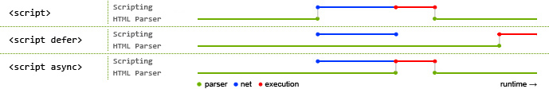

## HTML5语义化
什么是语义化？就是用合理、正确的标签来展示内容，比如h1~h6定义标题。

### 好处
+ 易于用户阅读，样式丢失的时候能让页面呈现清晰的结构。
+ 有利于SEO，搜索引擎根据标签来确定上下文和各个关键字的权重。
+ 方便其他设备解析，如盲人阅读器根据语义渲染网页
+ 有利于开发和维护，语义化更具可读性，代码更好维护，与CSS3关系更和谐。


## viewport
viewport 的字面意思为视图窗口，在移动 web 开发中使用。表示将设备浏览器宽度虚拟成一个特定的值（或计算得出），这样利于移动web站点跨设备显示效果基本一致。移动版的 Safari 浏览器最先引进了 viewport 这个 meta tag，让网页开发者来控制 viewport 的大小和缩放，其他手机浏览器也基本支持。

在移动端浏览器当中，存在着两种视口，一种是可见视口（也就是我们说的设备大小），另一种是视窗视口（网页的宽度是多少）。 举个例子：如果我们的屏幕是320像素 * 480像素的大小（iPhone4），假设在浏览器中，320像素的屏幕宽度能够展示980像素宽度的内容。那么320像素的宽度就是可见视口的宽度，而能够显示的980像素的宽度就是视窗视口的宽度。

为了显示更多的内容，大多数的浏览器会把自己的视窗视口扩大，简易的理解，就是让原本320像素的屏幕宽度能够容下980像素甚至更宽的内容（将网页等比例缩小）。

### viewport属性值
+ width 设置 layout viewport 的宽度，为一个正整数，或字符串 "width-device"。device-width 指的是设备的物理宽度，width 是页面宽度。
+ initial-scale 设置页面的初始缩放值，为一个数字，可以带小数
+ minimum-scale 允许用户的最小缩放值，为一个数字，可以带小数
+ maximum-scale 允许用户的最大缩放值，为一个数字，可以带小数
+ height 设置 layout viewport 的高度，这个属性对我们并不重要，很少使用
+ user-scalable 是否允许用户进行缩放，值为 "no" 或 "yes", no 代表不允许，yes 代表允许这些属性可以同时使用，也可以单独使用或混合使用，多个属性同时使用时用逗号隔开就行了。

### 常见设置
```html
<meta name="viewport" content="width=device-width, initial-scale=1, maximum-scale=1, user-scalable=no">
```
这里我们设置 viewport 为设备宽度，然后配合 rem 布局即可实现页面等比缩放的功能，见模板仓库：[vue-h5-template](https://github.com/NameWjp/vue-h5-template)


## src 和 href 的区别
src 和 href 都是用来引用外部的资源，他们的区别如下：
+ src 表示对资源的引用，它指向的内容会嵌入到当前标签所在的位置。src 会将其指向的资源下载并应用到文档内，如请求 js 脚本。当浏览器解析到该元素时，会暂停其它资源的下载和处理，直到将该资源加载、编译、执行完毕，所以一般 js 脚本都会放到页面底部。
+ href 表示超文本引用，它指向一些网络资源，建立和当前元素或本文档的链接关系。当浏览器识别到它指向的文件时，就会并行下载资源，不会停止对当前文档的处理。常用在 a、link 等标签上。


## preload 和 prefetch
### preload
`preload` 是 `<link>` 标签 `rel` 属性的属性值，同时需要配合 `as` 属性使用。  

`as` 指定将要预加载的内容的类型，使得浏览器能够：  

1. 更精确地优化资源加载优先级。
2. 匹配未来的加载需求，在适当的情况下，重复利用同一资源。
3. 为资源应用正确的内容安全策略。
4. 为资源设置正确的 Accept 请求头。

看一下这个示例：
```html
<link rel="preload" href="https://cdn.jsdelivr.net/npm/vue/dist/vue.js" as="script">
```
这种做法将把 `<link>` 标签塞入一个预加载器中。这个预加载器在不阻塞页面 onload 事件的情况下，去加载资源。我们可以通过以下两个示例来作一个对比：
```html
<!DOCTYPE html>
<html lang="en">
<head>
    <meta charset="UTF-8">
    <meta name="viewport" content="width=device-width, initial-scale=1.0">
    <title>Document</title>
    <script>
        console.time('load')
    </script>
    <script src="https://cdn.jsdelivr.net/npm/vue/dist/vue.js"></script>
    <script src="https://cdn.bootcdn.net/ajax/libs/echarts/2.1.10/chart/bar.js"></script>
    <script src="https://unpkg.com/element-ui/lib/index.js"></script>
    <link rel="stylesheet" href="https://unpkg.com/element-ui/lib/theme-chalk/index.css">
</head>
<body>
<script>
window.onload = () => {
    console.timeEnd('load') // load: 1449.759033203125ms
}
</script>
</body>
</html>
```
上面这个示例从加载到触发 onload 事件需要大概 1400 ms 的时间。再看一下使用 preload 预加载的时间：
```html
<link rel="preload" href="https://cdn.jsdelivr.net/npm/vue/dist/vue.js" as="script">
<link rel="preload" href="https://cdn.bootcdn.net/ajax/libs/echarts/2.1.10/chart/bar.js" as="script">
<link rel="preload" href="https://unpkg.com/element-ui/lib/index.js" as="script">
<link rel="preload" href="https://unpkg.com/element-ui/lib/theme-chalk/index.css" as="style">

window.onload = () => {
    console.timeEnd('load') // load: 10.8818359375ms
}
```
用 preload 来加载资源，只需要 10 ms 就触发了 onload 事件，说明同样是下载文件，使用 preload 不会阻塞 onload 事件。注意这样加载的话无法在 onload 中使用这些文件提供的方法，适合加载一些无关紧要的文件。

### prefetch
`prefetch` 和 `preload` 不同，使用 `prefetch` 属性指定的资源将在浏览器空闲时间下下载。

在资源的请求头如果发现有下面这个属性，就代表它是通过 `prefetch` 加载的：
```js
purpose: prefetch
```

另外，空闲时间是如何确定、如何获取的，目前还没有相关 API。


## defer 和 async 的区别
defer 的执行时间是在所有元素解析完成之后，DOMContentLoaded 事件触发之前。多个 defer 定义的 js 会按照它们的引入顺序执行。

async 的执行时间是在当前 JS 脚本下载完成后，所以多个 async script 是执行顺序是不固定的。async只能用于加载一些独立无依赖的代码。


