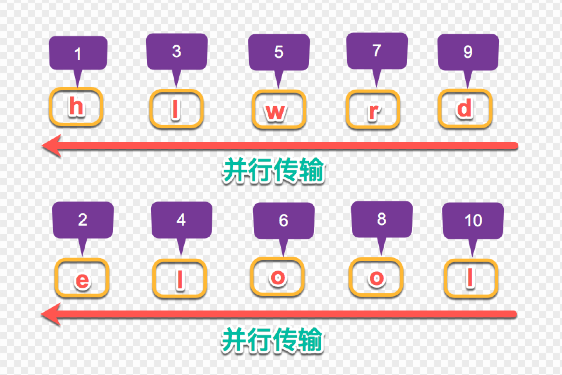

## 一个 TCP 连接能发几个 HTTP 请求?
HTTP 1.0 版本协议一个 TCP 只能发送一个 HTTP 请求，但是服务器实现了 Connection: Keep-Alive，因此一个 TCP 可以发送多个 HTTP 请求但请求不能并发。  
HTTP 1.1 版本将 Connection: Keep-Alive 纳入标准。  
HTTP 2.0 版本协议，支持多用复用，一个 TCP 连接是可以并发多个 HTTP 请求的。  


## HTTP 缓存
HTTP 缓存主要分为以下两种：
1. 强缓存
2. 协商缓存  

浏览器从请求接口到呈现页面会经过以下阶段：  
  
两者的主要区别是使用本地缓存的时候，是否需要向服务器验证本地缓存是否依旧有效。顾名思义，协商缓存，就是需要和服务器进行协商，最终确定是否使用本地缓存。
### 强缓存
当浏览器向服务器发起请求时，服务器会将缓存规则放入 HTTP 响应报文的 HTTP 头中和请求结果一起返回给浏览器，控制强制缓存的字段分别是 Expires 和 Cache-Control，其中 Cache-Control 优先级比 Expires 高。当浏览器从缓存里拿数据的时候 http 里会显示 Memory Cache 或 Disk Cache。
#### Expires
Expires 是 http1.0 提出的一个表示资源过期时间的 header，它描述的是一个绝对时间，由服务器返回。由于设置的是绝对时间，当客户端在不同的时区时，则过期时间就会发生误差。
```
Expires: Wed, 11 May 2018 07:20:00 GMT
```
#### Cache-Control
Cache-Control 出现于 HTTP/1.1，优先级高于 Expires，表示的是相对时间。设置 max-age 字段为 300 则表示缓存该结果 300 秒。
```
Cache-Control: max-age=300
```
tips: Cache-Control 的其他用法
+ no-cache：表示在使用缓存之前，强制要求缓存把请求提交给原始服务器进行验证(协商缓存验证)。
+ no-store：不使用任何缓存。
+ public：表明响应可以被任何对象（包括：发送请求的客户端，代理服务器，等等）缓存，即使是通常不可缓存的内容。（例如：1.该响应没有 max-age 指令或 Expires 消息头；2.该响应对应的请求方法是 POST 。）
+ private：表明响应只能被单个用户缓存，不能作为共享缓存（即代理服务器不能缓存它）。私有缓存可以缓存响应内容，比如：对应用户的本地浏览器。

### 协商缓存
当浏览器对某个资源的请求没有命中强缓存（过期或者之前响应头设置为 `no-cache`），就会发一个请求到服务器，验证协商缓存是否命中，如果协商缓存命中，请求响应返回的 http 状态为 304 并且会显示一个 Not Modified 的字符串

协商缓存是利用的是【Last-Modified，If-Modified-Since】和【ETag、If-None-Match】这两对Header来管理的。  

#### Last-Modified、If-Modified-Since
Last-Modified 表示本地文件最后修改日期，浏览器会在 request header 加上 If-Modified-Since（上次请求返回的 Last-Modified 的值），询问服务器在该日期后资源是否有更新，有更新的话就会将新的资源发送回来  

但是如果在本地打开缓存文件，就会造成 Last-Modified 被修改，所以在 HTTP/1.1 出现了 ETag

#### ETag、If-None-Match
Etag 就像一个指纹，资源变化都会导致 ETag 变化，跟最后修改时间没有关系，ETag 可以保证每一个资源是唯一的  

If-None-Match 的 header 会将上次返回的 Etag 发送给服务器，询问该资源的 Etag 是否有更新，有变动就会发送新的资源回来。

### 总结
HTTP/1.1 的缓存机制对比 HTTP/1.0 的缓存机制有以下优点：  
1. 使用相对时间设置强缓存，解决了不同时区不同客户端缓存时间不同的问题。
2. 使用 ETag 代替 Last-Modified，解决了打开文件不修改，缓存会失效的问题。


## keep-alive 和多路复用的区别
### 区别
keep-alive 是指 TCP 处理完一个 HTTP 连接后不关闭，可以继续处理下一个 HTTP 连接（阻塞的）。多路复用是 HTTP2 的特性，指多个 HTTP 连接可以同时在一个 TCP 连接上处理（并行的）。
### 原因
在 HTTP1.1 的协议中，我们传输的 request 和 response 都是基本于文本的，这样就会引发一个问题：所有的数据必须按顺序传输，比如需要传输：hello world，只能从 h 到 d 一个一个的传输，不能并行传输，因为接收端并不知道这些字符的顺序，所以并行传输在 HTTP1.1 是不能实现的。我们假设 Apache 设置了最大并发数为 300，因为浏览器限制，浏览器发起的最大请求数为6，也就是服务器能承载的最高并发为 50。  
  
HTTP/2 引入二进制数据帧和流的概念，其中帧对数据进行顺序标识，如下图所示，这样浏览器收到数据之后，就可以按照序列对数据进行合并，而不会出现合并后数据错乱的情况。同样是因为有了序列，服务器就可以并行的传输数据，这就是流所做的事情。HTTP/2 对同一域名下所有请求都是基于流，也就是说同一域名不管访问多少文件，也只建立一路连接。同样 Apache 的最大连接数为 300，因为有了这个新特性，最大的并发就可以提升到 300，比原来提升了 6 倍！  
  