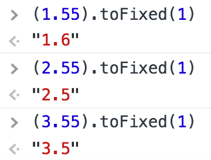
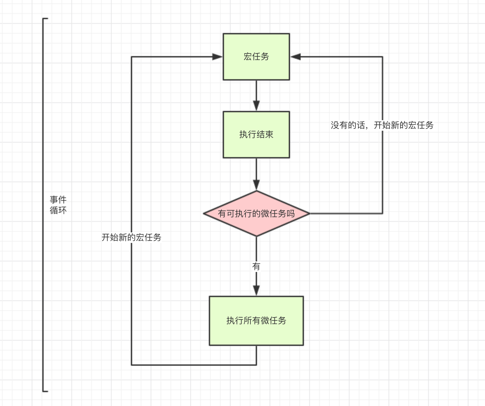
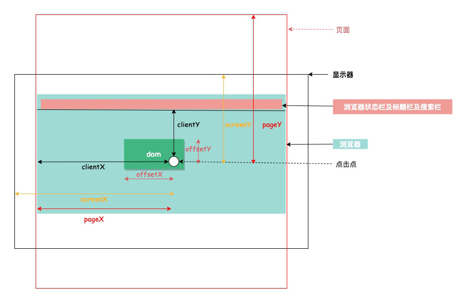
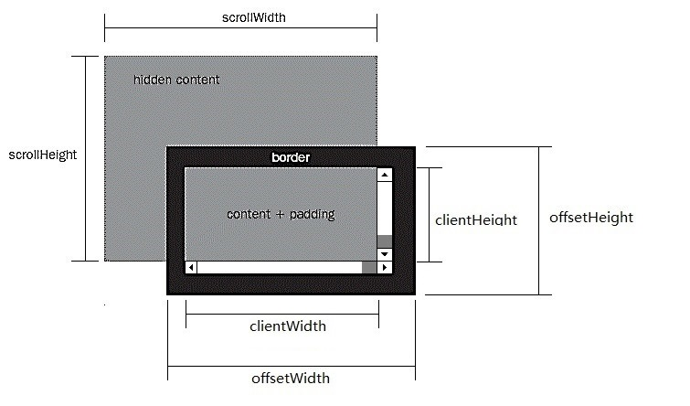

## javascript 里的最大安全数是多少，为什么
js里采用 IEEE754 标准，采用双精度存储数值，存储结构如下。  


所谓 “安全整数”，就是说该整数与其双精度浮点数表示是一一对应的，即该整数有且仅有一个双精度浮点数表示，其该双精度浮点数表示有且仅有一个对应的整数。例如在控制台打印如下内容：
```
> Math.pow(2, 53)
9007199254740992
> Math.pow(2, 53) + 1
9007199254740992
```
说明 2^53 并不是最大安全数，它和 2^53 + 1 对应一个整数
```
2^53 是这样存的：
符号位：0 指数：53 尾数：1.000000...000 （小数点后一共52个0）

2^53 + 1：
符号位：0 指数：53 尾数：1.000000...000 （小数点后一共52个0）
```
为什么 +1 没有被存进去？因为尾数部分最多只能存 52 位，超出这个位数的数字尾部会被忽略，再考虑到默认第一位总是 1 不计入 52 位中，所以最大安全数是：2^53 - 1

不过由于 ES6 的普及，出现了新的数据类型 BigInt，它可以表示任意大的整数，在一定程度上 js 也就没有最大安全数这个概念了。

参考：
+ [https://blog.windstone.cc/js/data-types/number/floating.html#%E8%AE%A1%E7%AE%97%E8%AF%AF%E5%B7%AE](https://blog.windstone.cc/js/data-types/number/floating.html#%E8%AE%A1%E7%AE%97%E8%AF%AF%E5%B7%AE)
+ [https://www.zhihu.com/question/29010688](https://www.zhihu.com/question/29010688)
+ [https://github.com/camsong/blog/issues/9](https://github.com/camsong/blog/issues/9)


## 为什么 0.1 + 0.2 与 0.3 不相等，如何解决
js里采用 IEEE754 标准，采用双精度存储数值，将 0.1 和 0.2 转化成二进制的时候会无限循环。  
```js
0.1 -> 0.0001100110011001...(无限循环)
0.2 -> 0.0011001100110011...(无限循环)
```
所以必然会存在精度丢失的问题。  
解决方法：写一个公共方法，在计算的时候将 0.1 等小数转化整数，运算完成后再将其转化成小数。或者使用一些计算库，例如：[number-precision](https://github.com/nefe/number-precision)


## 小数四舍五入问题
在使用 toFixed 去四舍五入的时候会出现一些奇怪的问题如下：  
  
实际上，toFixed 函数对于四舍五入的规则与数学中的规则不同，而且并不是使用的网上所说的银行家舍入规则（四舍六入五考虑，五后非零就进一，五后为零看奇偶，五前为偶应舍去，五前为奇要进一），而是有一定的规则，具体可以查看这篇文章：[toFixed四舍五入的不准确性](https://juejin.cn/post/6927215610552123406)

很显然，这并不是我们想要的结果。我们可以用浏览器提供的 Intl.NumberFormat 构造函数来格式化数字，它有很好的浏览器支持（包括 IE11），这里我封装一个四舍五入的方法
```js
// minimumFractionDigits 和 maximumFractionDigits 分别代表最小和最大小数位数，例如分别取 2，3，则 format(1.1) 则为 1.10，format(1.1111) 则为 1.111
function roundFloat (value, decimal = 2) {
  const formatter = new Intl.NumberFormat('en-US', {
    minimumFractionDigits: decimal,      
    maximumFractionDigits: decimal,
  });
  return formatter.format(value);
}
```


## commonjs 和 es6 的区别
CommonJS 是一种模块规范，最初被应用于 Nodejs，成为 Nodejs 的模块规范。运行在浏览器端的 JavaScript 由于也缺少类似的规范，在 ES6 出来之前，前端也实现了一套相同的模块规范 (例如: AMD)，用来对前端模块进行管理。自 ES6 起，引入了一套新的 ES6 Module 规范，在语言标准的层面上实现了模块功能，而且实现得相当简单，有望成为浏览器和服务器通用的模块解决方案。但目前浏览器对 ES6 Module 兼容还不太好，我们平时在 Webpack 中使用的 export 和 import，会经过 Babel 转换为 CommonJS 规范。在使用上的差别主要有：
1. CommonJS 模块输出的是一个值的拷贝，ES6 模块输出的是值的引用。
2. CommonJS 模块是运行时加载，ES6 模块是编译时输出接口。
3. CommonJs 是单个值导出，ES6 Module可以导出多个。
4. CommonJs 是动态语法可以写在判断里，ES6 Module 静态语法只能写在顶层。
5. CommonJs 的 this 是当前模块，ES6 Module的 this 是 undefined。


## 什么是循环依赖？
"循环加载"（circular dependency）指的是，a脚本的执行依赖b脚本，而b脚本的执行又依赖a脚本。目前前端主要有两种加载模式方式，分别是：CommonJS 和 ES6 模块加载，webpack 在打包的时候会根据配置模拟两种加载模式去加载。
1. CommonJS 模块加载
CommonJS 模块的重要特性是加载时执行，即脚本代码在require的时候，就会全部执行。CommonJS 的做法是，一旦出现某个模块被"循环加载"，就只输出已经执行的部分，还未执行的部分不会输出。
2. ES6 模块加载
ES6 模块的运行机制与 CommonJS 不一样，它遇到模块加载命令import时，不会去执行模块，而是只生成一个引用。等到真的需要用到时，再到模块里面去取值。ES6 根本不会关心是否发生了"循环加载"，只是生成一个指向被加载模块的引用，需要开发者自己保证，真正取值的时候能够取到值。 
 
tips：建议阅读阮一峰的文章 [http://www.ruanyifeng.com/blog/2015/11/circular-dependency.html](http://www.ruanyifeng.com/blog/2015/11/circular-dependency.html)


## session、cookie、token 和 jwt 的区别
它们出现的原因是因为 http 是无状态的，所以需要一种手段去标示哪些 http 请求是那个用户发送的。  
1. session 存储于服务器，可以理解为一个状态列表，拥有一个唯一识别符号 sessionId，通常存放于 cookie 中。服务器收到 cookie 后解析出 sessionId，再去 session 列表中查找，才能找到相应 session。所以 session 的实现依赖于 cookie。
2. cookie 类似一个令牌，装有 sessionId，存储在客户端，浏览器通常会自动添加，存储大小为 4kb。
3. token 也类似一个令牌，无状态，用户信息都被加密到 token 中，服务器收到 token 后解密就可知道是哪个用户。需要开发者手动添加。
4. jwt 是一个跨域认证的方案


## DOM 事件触发流程
1. 捕获阶段：从父节点到目标节点
2. 目标阶段：在目标元素上触发事件
3. 冒泡阶段：从目标节点到父节点


## target 和 currentTarget 区别
+ event.target  
返回触发事件的元素（例如用户点击时会返回点击位置最底层的 dom 元素）
+ event.currentTarget  
返回绑定事件的元素


## 什么是事件委托
事件委托利用了事件冒泡，只指定一个事件处理程序，就可以管理某一类型的所有事件。使用事件委托的一个好处就是可以节省内存。
```js
<ul>
  <li>
    <span>苹果</span>
  </li>
  <li>
    <span>香蕉</span>
  </li>
  <li>
    <span>凤梨</span>
  </li>
</ul>

// good
document.querySelector('ul').onclick = (event) => {
  let target = event.target
  while (target.nodeName !== 'UL') {
    // 这里捕获 li 元素
    if (target.nodeName === 'LI') {
      break;
    }
    target = target.parentNode;
  }
  console.log(target)
}

// bad
document.querySelectorAll('li').forEach((e) => {
  e.onclick = function() {
    console.log(this.innerHTML)
  }
}) 
```
最后说一下其实在 Vue 和 React 里大多数情况是不需要事件代理的，只要保证 for 循环绑定的是一个函数就不会有内存浪费的问题。而且 React 有自己的一套事件机制，我们使用的都是由 React 合成的事件，React 内部会把所有的事件绑定到 document 上，采用的就是事件代理的思想，在框架层面已经帮我们优化了。


## prototype 和 `__proto__` 的关系是什么
结论：
1. `prototype` 用于访问函数的原型对象。
2. `__proto__` 用于访问对象实例的原型对象（值得注意的是这个属性是非标准的，只不过各浏览器都实现了它，推荐使用 es6 标准的 Object.getPrototypeOf() 来获取原型对象）。
```js
function Test() {}
const test = new Test()
test.__proto__ == Test.prototype // true
```
也就是说，函数拥有 prototype 属性，对象实例拥有 `__proto__` 属性，它们都是用来访问原型对象的。  
最后贴一个图，有助于理解：


## 原型链
所有的 JS 对象都有一个 `__proto__` 属性，指向它的原型对象。当试图访问一个对象的属性时，如果没有在该对象上找到，它还会搜寻该对象的原型，以及该对象的原型的原型，依次层层向上搜索，直到找到一个名字匹配的属性或到达原型链的末尾（末尾是 null）。


## 闭包
闭包是指有权访问另一个函数作用域中的变量的函数。
```js
function sayName() {
  const name = 'xiaoming'

  return () => {
    console.log(`Hi! ${name}`)
  }
}
const test = sayName()
test() // Hi! xiaoming
```
虽然 sayName 函数已经执行完毕，但是其活动对象也不会被销毁，因为 test 函数仍然引用着 sayName 函数中的变量 name，这就是闭包。但也因为闭包引用着另一个函数的变量，导致另一个函数即使不使用了也无法销毁，所以闭包使用过多，会占用较多的内存，这也是一个副作用。


## 内存回收
在 JS 中，有两种内存回收算法。第一种是引用计数垃圾收集，第二种是标记-清除算法（从2012年起，所有现代浏览器都使用了标记-清除垃圾回收算法）。
### 引用计数垃圾收集
如果一个对象没有被其他对象引用，那它将被垃圾回收机制回收
```js
let o = { a: 1 }
```
一个对象被创建，并被 o 引用。
```js
o = null
```
刚才被 o 引用的对象现在是零引用，将会被回收。
#### 循环引用
引用计数垃圾收集有一个缺点，就是循环引用会造成对象无法被回收。
```js
function f(){
  var o = {};
  var o2 = {};
  o.a = o2; // o 引用 o2
  o2.a = o; // o2 引用 o

  return "azerty";
}

f();
```
在 f() 执行后，函数的局部变量已经没用了，一般来说，这些局部变量都会被回收。但上述例子中，o 和 o2 形成了循环引用，导致无法被回收。
### 标记-清除算法
这个算法假定设置一个叫做根（root）的对象（在 Javascript 里，根是全局对象）。垃圾回收器将定期从根开始，找所有从根开始引用的对象，然后找这些对象引用的对象……从根开始，垃圾回收器将找到所有可以获得的对象和收集所有不能获得的对象，之后会清除掉所有不能获得的对象。

对于刚才的例子来说，在 f() 执行后，由于 o 和 o2 从全局对象出发无法获取到，所以它们将会被回收。  
### 高效使用内存
在 JS 中能形成作用域的有函数、全局作用域、with，在 es6 还有块作用域。局部变量随着函数作用域销毁而被释放，全局作用域需要进程退出才能释放或者使用 delete 和赋空值 `null` `undefined`。  

在 V8 中用 delete 删除对象可能会干扰 V8 的优化，所以最好通过赋值方式解除引用。  

参考资料：[内存管理](https://developer.mozilla.org/zh-CN/docs/Web/JavaScript/Memory_Management)


## 对象浅拷贝和深拷贝有什么区别
在 JS 中，除了基本数据类型，还存在对象、数组这种引用类型。对于基本类型，浅拷贝和深拷贝都会拷贝它的值。对于引用类型，浅拷贝只会拷贝它的地址，而深拷贝会创建一个一样的对象。  
浅拷贝：Object.assign，扩展运算符等。  
深拷贝：JSON.parse(JSON.stringify(obj))（不过这个方法会有很多坑，详见：[https://www.jianshu.com/p/b084dfaad501](https://www.jianshu.com/p/b084dfaad501)），lodash 的 cloneDeep 方法等。


## javascript 里的类型判断
1. 判断 Null 和 Undefined  
使用全等 === 来判断
2. 判断 Boolean、Number、String、BigInt、Symbol、Function  
使用 typeof 操作符来判断，它会返回构造函数的小写名称，不过对于数组和对象都会返回 object
3. 判断数组  
使用 Array.isArray 静态方法来判断，会返回布尔值
4. 判断 Promise  
```js
export function isDef (val) {
  return val !== undefined && val !== null
}
export function isPromise (val) {
  return (
    isDef(val) &&
    typeof val.then === 'function' &&
    typeof val.catch === 'function'
  )
}
```
5. 判断对象、RegExp、Date 等  
使用 Object.prototype.toString.call 这个万能方法，它会返回 [object type] 字符串，type 就是对应的类型
```js
// 纯对象
Object.prototype.toString.call(obj) === '[object Object]'
// RegExp
Object.prototype.toString.call(reg) === '[object RegExp]'
// Date
Object.prototype.toString.call(date) === '[object Date]'
```
6. 判断构造函数的原型是否在对象的原型链上  
使用instanceof 操作符
```js
function Fruit(name, color) {
  this.name = name;
  this.color = color;
}

const apple = new Fruit("apple", "red");

apple instanceof Fruit  // true
apple instanceof Array   // false
```


## javascript 有哪些数据类型
1. Undefined
2. Null
3. Boolean
4. Number 
5. String
6. Object
7. Symbol
8. BigInt


## 内置对象和函数
包括许多构造函数，例如 String、Array 等，还包括一些工具对象和函数：Intl、JSON、Math，具体查看：[JavaScript 标准内置对象](https://developer.mozilla.org/zh-CN/docs/Web/JavaScript/Reference/Global_Objects)

注意像 String、Number、Boolean 我们定义的时候一般不会使用 new 的方式，而是使用定义字面量的方式定义。例如 "i am string"，当我们调用它的字面量的方法时，语法编译器会自动进行装箱操作，将其包装成 String 对象，然后调用其方法，之后再进行拆箱操作将其转回字面量。


## cookie、localStorage、sessionStorage区别
|特性|cookie|localStorage|sessionStorage|
|-|-|-|-|
|由谁初始化|客户端或服务器，服务器可以使用`Set-Cookie`请求头|客户端|客户端|
|数据的生命周期|一般由服务器生成，可设置失效时间。在浏览器生成，默认失效时间是关闭浏览器之后失效|永久保存，可清除|仅在当前会话有效，关闭页面后清除|
|存放数据大小|4KB|5MB|5MB|
|与服务器通信|每次都会携带在HTTP头中（Secure 和 SameSite 会影响是否携带），如果使用cookie保存过多数据会带来性能问题|仅在客户端保存|仅在客户端保存|
|用途|一般由服务器生成，用于标识用户身份|用于浏览器缓存数据|用于浏览器缓存数据|
|访问权限|任意窗口|任意窗口|当前页面窗口|
|作用范围|可以设置 二级、三级 域名携带，设置二级域名会使所有匹配的三级域名携带 cookie|只能在当前域名携带|只能在当前域名携带|


## 请简述 JavaScript 中的 this
this 取值符合以下规则： 
1. 在调用函数时使用 new 关键字，函数内的 this 是一个全新的对象。
2. 如果 apply、call 或 bind 方法用于调用、创建一个函数，函数内的 this 就是作为参数传入这些方法的对象。
3. 当函数作为对象里的方法被调用时，函数内的 this 是调用该函数的对象。比如当 `obj.method()` 被调用时，函数内的 this 将绑定到 obj 对象。
4. 如果调用函数不符合上述规则，那么 this 的值指向全局对象（global object）。浏览器环境下 this 的值指向 window 对象，但是在严格模式下('use strict')，this 的值为 undefined。
5. 如果符合上述多个规则，则较高的规则（1 号最高，4 号最低）将决定 this 的值。
6. 如果该函数是 ES2015 中的箭头函数，将忽略上面的所有规则，this 被设置为它被创建时的上下文。


## window.onload 和 DOMContentLoaded 的区别
当整个页面及所有依赖资源如样式表和图片都已完成加载时，将触发load事件。

它与 DOMContentLoaded不同，当纯 HTML 被完全加载以及解析时，DOMContentLoaded 事件会被触发，而不必等待样式表，图片或者子框架完成加载。


## Object 与 Map 的区别
1. Object 只能选择字符、数值、符号作为 key。Chrome 中使用 for-in 语句遍历 Object 属性时会遵循一个规律：首先遍历所有数值键（如果能转成数字的话），按照数值升序排列。其次遍历所有字符串键，按照加入时间升序排列。最后遍历所有 Symbol 键，按照加入时间升序排列。
2. Map 可以使用任何类型的数据作为 key，Map 实例内部会维护键值对的插入顺序，因此可以根据插入顺序执行迭代操作。

### 选择 Object 还是 Map
对于多数Web开发任务来说，选择 Object 还是 Map 只是个人偏好问题，影响不大。不过，对于在乎内存和性能的开发者来说，对象和映射之间确实存在显著的差别。
#### 1. 内存占用
Object 和 Map 的工程级实现在不同浏览器间存在明显差异，但存储单个键/值对所占用的内存数量都会随键的数量线性增加。批量添加或删除键/值对则取决于各浏览器对该类型内存分配的工程实现。

不同浏览器的情况不同，但给定固定大小的内存， Map 大约可以比 Object 多存储 50% 的键/值对。
#### 2. 插入性能
向 Object 和 Map 中插入新键/值对的消耗大致相当，不过插入Map 在所有浏览器中一般会稍微快一点儿。对这两个类型来说，插入速度并不会随着键/值对数量而线性增加。

如果代码涉及大量插入操作，那么显然 Map 的性能更佳。
#### 3. 查找速度
与插入不同，从大型 Object 和 Map 中查找键/值对的性能差异极小，但如果只包含少量键/值对，则 Object 有时候速度更快。在把 Object 当成数组使用的情况下（比如使用连续整数作为属性），浏览器引擎可以进行优化，在内存中使用更高效的布局。

这对 Map 来说是不可能的。对这两个类型而言，查找速度不会随着键/值对数量增加而线性增加。如果代码涉及大量查找操作，那么某些情况下可能选择 Object 更好一些。
#### 4. 删除性能
使用 delete 删除 Object 属性的性能一直以来饱受诟病，目前在很多浏览器中仍然如此。为此，出现了一些伪删除对象属性的操作，包括把属性值设置为 undefined 或 null 。但很多时候，这都是一
种讨厌的或不适宜的折中。

而对大多数浏览器引擎来说， Map 的 delete() 操作都比插入和查找更快。如果代码涉及大量删除操作，那么毫无疑问应该选择 Map 。


## 为什么 WeakMap 和 WeakSet 的键只能使用对象？
因为基本类型作为参数在函数中传递的是值的拷贝， WeakMap 和 WeakSet 没法判断 key 是否还在使用。
+ 使用引用类型作为 key
```js
const m = new WeakMap()
m.set({}, 100) // 由于 {} 没有在其他地方引用，所以在垃圾回收时，这个值也会被回收。

const a = {}
m.set(a, 100) // 如果使用这种方式，则不会被回收。因为 {} 有 a 变量在引用它。

a = null // 将 a 置为空后，m 里的值 100 在垃圾回收时将会被回收。
```
+ 如果允许基本类型作为 key
```js
const a = 'abc' // 由于基本数据类型在传递时，传递的是值，而不是引用。
m.set(a, 100)   // 所以执行 set 操作时，实际上是将新的 'abc' 和 100 关联起来，而不是原来 a 变量指向的那个。
	              // 那这样就会有问题，m 里存储的永远是没有被引用的键，随时都会被回收。
```


## javascript 事件循环
javascript 是一门单线程的语言，会将执行的代码分为 `宏任务` 和 `微任务`。不同的代码会被推到不同的任务队列里，浏览器执行的过程中会先执行 `宏任务` 中的代码，执行完后会再执行 `微任务` 里的代码，执行完后再执行 `宏任务` 里的代码，依次类推，如下图：  

### 宏任务
|类型|浏览器|Node|
|-|-|-|
|I/O|✅|✅|
|setTimeout|✅|✅|
|setInterval|✅|✅|
|setImmediate|❌|✅|
|requestAnimationFrame|✅|❌|
### 微任务
|类型|浏览器|Node|
|-|-|-|
|process.nextTick|❌|✅|
|MutationObserver|✅|❌|
|Promise.then catch finally|✅|✅|
|queueMicrotask|✅|✅|
### 总结
有一道测试题如下:
```js
console.log('1');

setTimeout(function() {
  console.log('2');
  process.nextTick(function() {
    console.log('3');
  })
  new Promise(function(resolve) {
    console.log('4');
    resolve();
  }).then(function() {
    console.log('5')
  })
})
process.nextTick(function() {
  console.log('6');
})
new Promise(function(resolve) {
  console.log('7');
  resolve();
}).then(function() {
  console.log('8')
})

setTimeout(function() {
  console.log('9');
  process.nextTick(function() {
    console.log('10');
  })
  new Promise(function(resolve) {
    console.log('11');
    resolve();
  }).then(function() {
    console.log('12')
  })
})
```
结合上面的知识点，结果为：1，7，6，8，2，4，3，5，9，11，10，12。  
这里需要注意的是在 setTimeout 回调执行完后会被认为一个 `宏任务` 执行结束，会去检测 `微任务` 队列，等 `微任务` 队列执行完后会再去检测 `宏任务` 队列（也就是说每一个 setTimeout 回调执行后就会看看是否有 `微任务` 有的话就执行）。在上面的例子里，第一个 setTimeout 回调执行完后，即使 `宏任务` 里还有一个 setTimeout 也不会立刻执行，而是回去查看 `微任务` 队列是否有可执行的。  

另外需要注意的是，如果处于微任务队列，又立即注册了立即执行的微任务，那么此微任务会立即执行：
```js
setTimeout(() => console.log(1))

new Promise(resolve => {
  resolve()
  console.log(2)
}).then(() => {
  console.log(3)
  Promise.resolve().then(_ => {
    console.log(4)
  }).then(_ => {
    Promise.resolve().then(_ => {
      console.log(5)
    })
  })
})

console.log(6)
```
例如上述代码会输出：2，6，3，4，5，1


## 图解 DOM 位置关系
### 位置关系图

### 尺寸关系图


offsetHeight 可以用来计算元素的物理空间，此空间包括内容，padding 和 border（还包括滚动条的宽度，但大多时候滚动条的宽度是计算到 padding 和内容中的）。

scrollHeight 用来计算可滚动容器的大小，包括不可见的部分。

clientHeight 表示可视区域，包括内容和 padding ，如果有滚动条，还需要减去滚动条的宽度。

常见用于判断是否滚动到页面底部的判断：scrollHeight - scrollTop === clientHeight。


## 常见的位运算符有哪些？其计算规则是什么？
|运算符|<div style="width:80px;">描述</div>|<div style="width:70px;">使用</div>|运算规则|
|-|-|-|-|
|`&`|按位与|`a & b`|在 a、b 的位表示中，每一个对应的位，都为 1 则返回 1，否则返回 0|
|`|`|按位或|`a | b`|在 a、b 的位表示中，每一个对应的位，只要有一个为 1 则返回 1，否则返回 0|
|`^`|按位异或|`a ^ b`|在 a、b 的位表示中，每一个对应的位，两个不相同则返回 1，相同则返回 0|
|`~`|按位非|`~ a`|反转被操作数的位|
|`<<`|左移|`a << b`|将 a 的二进制串向左移动 b 位，高位丢弃，低位补 0|
|`>>`|右移|`a >> b`|将 a 的二进制串向右移动 b 位，正数高位0，负数高位补1，低位丢弃|
|`>>>`|无符号右移|`a >>> b`|把 a 的二进制表示向右移动 b 位，丢弃被移出的所有位，并把左边空出的位都填充为 0|
这里需要注意`右移`的时候高位根据符号位来填充，`无符号右移`的时候是用 0 填充。  
另外需要注意的是计算机存储负数的时候是用`补码`（反码 + 1）存储的，例如：`~6`，即
```js
  0000 0110 // 原码
  1111 1001 // 取反后的原码，发现是负数，立刻取反码
  1000 0110 // 反码
  1000 0111 // 补码，最终存储的结果为 -7
```
最后说一下运用场景，由于位运算是在数字底层进行操作，优点在于运算速度快，但缺点很明显，不够直观。一个比较常见的运用场景是定义不同的状态，例如：ELEMENT_HTML: 1, ELEMENT_SVG: 1 << 1 等等，可以参考：[https://github.com/NameWjp/renderer/blob/master/src/flags.js](https://github.com/NameWjp/renderer/blob/master/src/flags.js)


## escape，encodeURI，encodeURIComponent 的区别
首先我们需要知道为什么要编码，编码的主要目的有以下几点：
+ URL 有规范，在参数值中出现 & 字符会截断参数，所以当你的参数本来就有 & 字符时如何不编码就会解析出错
+ URL 使用中文不符合规范，容易出现乱码
### escape
escape 是对字符串进行编码，作用是让它们在所有电脑上可读。编码之后的效果是 %XX 或者 %uXXXX 这种形式。其中 `ASCII字母 数字 @*/+` 这几个字符不会被编码，其余的都会。最关键的是，当你需要对 URL 编码时，请忘记这个方法，这个方法是针对字符串使用的，不适用于 URL。
### encodeURI
encodeURI 设计出来的目的就是为了编码整个 URL 的，不会对 `ASCII字母 数字 ~!@#$&*()=:/,;?+'` 这些字符编码，编码出来的字符串可以直接访问。但是有时会有问题，例如：http//xxx?t==v，我们的本意是传递 `t=` 和 `v` 这一对查询条件，由于 encodeURI 不会对 `=` 进行编码，进而出现的问题。
### encodeURIComponent
encodeURIComponent 设计出来的目的是为了编码 URL 的查询参数的，它的编码范围更大，不会对 `ASCII字母 数字 ~!*()'` 这些字符编码。由于它可以编码 `? &` 这类字符，所以它可以解决 encodeURI 出现的问题，例如：\`http//xxx?${encodeURIComponent(t=)}=${encodeURIComponent(v)}\`


## 对象的遍历顺序
对象的遍历并不是按照 key 加入的顺序来遍历的，而是按照以下的规则遍历：
1. 首先遍历所有数值键（如果能转成数字的话），按照数值升序排列。
2. 其次遍历所有字符串键，按照加入时间升序排列。
3. 最后遍历所有 Symbol 键，按照加入时间升序排列。