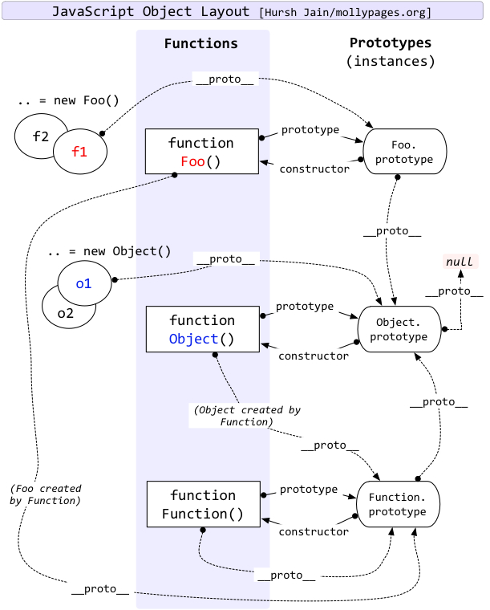

## js里的最大安全数是多少，为什么
js里采用 IEEE754 标准，采用双精度存储数值，存储结构如下。  

由于指数最大可以偏移 Math.pow(2, 11) 位，大于最大可表示的 52 位尾数，所以最大值由尾数 52 位决定。  
又因为尾数部分在规约形式下第一位总为 1 可以不写，所以 js 最大安全数为 Math.pow(2,53) - 1（64位浮点的后52位+被省略的1位）。不过由于 ES6 的普及，出现了新的数据类型 BigInt，它可以表示任意大的整数，在一定程度上 js 也就没有最大安全数这个概念了。

## 为什么 0.1 + 0.2 与 0.3 不相等，如何解决
js里采用 IEEE754 标准，采用双精度存储数值，存储结构如下。  

由于 0.1 和 0.2 转化成二进制的时候会无限循环。  
```js
0.1 -> 0.0001100110011001...(无限循环)
0.2 -> 0.0011001100110011...(无限循环)
```
所以必然会存在精度丢失的问题。  
解决方法：写一个公共方法，在计算的时候将 0.1 等小数转化整数，运算完成后再将其转化成小数。

## commonjs 和 es6 的区别
CommonJS 是一种模块规范，最初被应用于 Nodejs，成为 Nodejs 的模块规范。运行在浏览器端的 JavaScript 由于也缺少类似的规范，在 ES6 出来之前，前端也实现了一套相同的模块规范 (例如: AMD)，用来对前端模块进行管理。自 ES6 起，引入了一套新的 ES6 Module 规范，在语言标准的层面上实现了模块功能，而且实现得相当简单，有望成为浏览器和服务器通用的模块解决方案。但目前浏览器对 ES6 Module 兼容还不太好，我们平时在 Webpack 中使用的 export 和 import，会经过 Babel 转换为 CommonJS 规范。在使用上的差别主要有：
1. CommonJS 模块输出的是一个值的拷贝，ES6 模块输出的是值的引用。
2. CommonJS 模块是运行时加载，ES6 模块是编译时输出接口。
3. CommonJs 是单个值导出，ES6 Module可以导出多个。
4. CommonJs 是动态语法可以写在判断里，ES6 Module 静态语法只能写在顶层。
5. CommonJs 的 this 是当前模块，ES6 Module的 this 是 undefined。

## 什么是循环依赖？
"循环加载"（circular dependency）指的是，a脚本的执行依赖b脚本，而b脚本的执行又依赖a脚本。目前前端主要有两种加载模式方式，分别是：CommonJS 和 ES6 模块加载，webpack 在打包的时候会根据配置模拟两种加载模式去加载。
1. CommonJS 模块加载
CommonJS 模块的重要特性是加载时执行，即脚本代码在require的时候，就会全部执行。CommonJS 的做法是，一旦出现某个模块被"循环加载"，就只输出已经执行的部分，还未执行的部分不会输出。
2. ES6 模块加载
ES6 模块的运行机制与 CommonJS 不一样，它遇到模块加载命令import时，不会去执行模块，而是只生成一个引用。等到真的需要用到时，再到模块里面去取值。ES6 根本不会关心是否发生了"循环加载"，只是生成一个指向被加载模块的引用，需要开发者自己保证，真正取值的时候能够取到值。 
 
tips：建议阅读阮一峰的文章 [http://www.ruanyifeng.com/blog/2015/11/circular-dependency.html](http://www.ruanyifeng.com/blog/2015/11/circular-dependency.html)

## cookie token 和 session 的区别
它们出现的原因是因为 http 是无状态的，所以需要一种手段去标示哪些 http 请求是那个用户发送的。  
1. session 存储于服务器，可以理解为一个状态列表，拥有一个唯一识别符号 sessionId，通常存放于 cookie 中。服务器收到 cookie 后解析出 sessionId，再去 session 列表中查找，才能找到相应 session。所以 session 的实现依赖于 cookie。
2. cookie 类似一个令牌，装有 sessionId，存储在客户端，浏览器通常会自动添加，存储大小为 4kb。
3. token 也类似一个令牌，无状态，用户信息都被加密到 token 中，服务器收到 token 后解密就可知道是哪个用户。需要开发者手动添加。
4. jwt 只是一个跨域认证的方案

## 防抖和节流函数
防抖：在指定的时间内不执行才会调用。例如调整浏览器窗口大小时，`resize` 次数过于频繁，但我们只需要调整完窗口后再计算，这里就可以用防抖处理。    
节流：控制调用的频率，多长时间内只能调用一次。例如商城里面的放大镜效果，`onmouseover` 触发过于频繁，这时就需要使用节流控制调用频率。

```js
/**
 * 防抖函数
 * 注意，fn不要使用箭头函数
 * @param {Function} fn
 * @param {Number} delay
 */
function debounce(fn, delay) {
  let timeId;
  return function(...args) {
    if (timeId) {
      clearTimeout(timeId)
    }
    timeId = setTimeout(() => {
      fn.call(this, ...args);
      timeId = null;
    }, delay);
  }
}

/**
 * 节流函数
 * 开始执行触发，离开后不触发
 * @param {Function} fn
 * @param {Number} delay
 */
function throttle(fn, delay) {
  let previous = 0;
  return function(...args) {
    const now = +new Date();
    if (now - previous > delay) {
      fn.call(this, ...args);
      previous = now;
    }
  }
}
```
在使用上可以使用 lodash 库提供的防抖和节流，功能更加完善。

## async 和 Generator 的关系，如何使用 Generator 实现 async
async 语法是内置自动执行器的 Generator 的语法糖。  
利用 `Generator` 实现 `async/await` 主要就是用一个函数（自动执行器）来包装 `Generator`，从而实现自动执行 `Generator`。  
每次执行 `next()` 返回的 `{ value, done }` 中的 value 是一个 Promise，所以要等它执行完毕后再执行下一次 `next()`，即在它的后面加一个 `then()` 函数，并且在 `then()` 函数中执行 next()。  
```js
function t(data) {
  return new Promise(r => setTimeout(() => r(data), 100))
}

function *test() {
  const data1 = yield t(1)
  console.log(data1)
  const data2 = yield t(2)
  console.log(data2)
  return 3
}

function async(generator) {
  return new Promise((resolve, reject) => {
    const gen = generator()

    function step(nextFun) {
      // 每一次 next() 都是返回这样的数据 { value: xx, done: false }，结束时 done 为 true
      let next
      try {
        // 如果 generator() 执行报错，需要 reject 给外面的 catch 函数
        next = nextFun()
      } catch(e) {
        return reject(e)
      }

      // done: true 代表 generator() 结束了
      if (next.done) {
        return resolve(next.value)
      }

      Promise.resolve(next.value).then(
        (val) => step(() => gen.next(val)), // 通过 next(val) 将 val 传给 yield 后面的变量 
        (err) => step(() => gen.trhow(err)),
      )
    }

    step(() => gen.next())
  })
}

// 1 2 3
async(test).then(val => console.log(val))
```

## 函数柯里化的优点和实现
柯里化的优点如下：
1. 参数复用
2. 提前返回
3. 延迟计算/运行
实现如下：
```js
function sub_curry(fn, ...params) {
  return function(...newParams) {
    return fn.apply(this, [...params, ...newParams]);
  };
}

function curry(fn, length) {
  length = length || fn.length;
  
  return function(...params) {
    if (params.length < length) {
      return curry(sub_curry.apply(this, [fn, ...params]), length - params.length);
    } else {
      return fn.apply(this, params);
    }
  };
}

// 使用
function test(a, b) {
    console.log(a, b)
}

curry(test)(1)(2) // 1 2
```
在使用上可以使用 lodash 库提供的 curry 函数，功能更加完善。

## 实现 compose 函数
compose（组合）函数特点：
+ compose 的参数是函数，返回的也是一个函数
+ 因为除了第一个函数的接受参数，其他函数的接受参数都是上一个函数的返回值，所以初始函数的参数是多元的，而其他函数的接受值是一元的
+ compsoe 函数可以接受任意的参数，所有的参数都是函数，且执行方向是自右向左的，初始函数一定放到参数的最右面
```js
function compose(...fns) {
    let isFirst = true
    return (...args) => {
      return fns.reduceRight((result, fn) => {
          if (!isFirst) return fn(result)
          isFirst = false
          return fn(...result)
      }, args)
    }
}

// 测试
const greeting = (firstName, lastName) => 'hello, ' + firstName + ' ' + lastName
const toUpper = str => str.toUpperCase()
const fn = compose(toUpper, greeting)
console.log(fn('jack', 'smith')) // HELLO, JACK SMITH
```
在使用上可以使用 lodash 库提供的 flowRight 函数。

## DOM 事件触发流程
1. 捕获阶段：从父节点到目标节点
2. 目标阶段：在目标元素上触发事件
3. 冒泡阶段：从目标节点到父节点

## target 和 currentTarget 区别
+ event.target  
返回触发事件的元素（例如用户点击时会返回点击位置最底层的 dom 元素）
+ event.currentTarget
返回绑定事件的元素

## 什么是事件委托
事件委托利用了事件冒泡，只指定一个事件处理程序，就可以管理某一类型的所有事件。使用事件委托的一个好处就是可以节省内存。
```js
<ul>
  <li>苹果</li>
  <li>香蕉</li>
  <li>凤梨</li>
</ul>

// good（这里如果存在嵌套的多个元素，可以利用 parentNode 属性从 event.target 一直往上找，找到需要的元素为止）
document.querySelector('ul').onclick = (event) => {
  let target = event.target
  if (target.nodeName === 'LI') {
    console.log(target.innerHTML)
  }
}

// bad
document.querySelectorAll('li').forEach((e) => {
  e.onclick = function() {
    console.log(this.innerHTML)
  }
}) 
```
最后说一下其实在 Vue 和 React 里大多数情况是不需要事件代理的，只要保证 for 循环绑定的是一个函数就不会有内存浪费的问题。而且 React 有自己的一套事件机制，我们使用的都是由 React 合成的事件，React 内部会把所有的事件绑定到 document 上，采用的就是事件代理的思想，在框架层面已经帮我们优化了。

## new 一个对象内部做了什么？
```js
function Test(){}
const test = new Test()
```
1. 创建一个新对象
```js
const obj = {}
```
2. 设置新对象的 constructor 属性为构造函数的名称，设置新对象的 `__proto__` 属性指向构造函数的 prototype 对象
```js
obj.constructor = Test
obj.__proto__ = Test.prototype
```
3. 调用构造函数，并将 this 指向新对象
```js
Test.call(obj)
```
4. 将初始化完毕的新对象地址，保存到等号左边的变量中

## prototype 和 `__proto__` 的关系是什么
结论：
1. `prototype` 用于访问函数的原型对象。
2. `__proto__` 用于访问对象实例的原型对象（值得注意的是这个属性是非标准的，只不过各浏览器都实现了它，推荐使用 es6 标准的 Object.getPrototypeOf() 来获取原型对象）。
```js
function Test() {}
const test = new Test()
test.__proto__ == Test.prototype // true
```
也就是说，函数拥有 prototype 属性，对象实例拥有 `__proto__` 属性，它们都是用来访问原型对象的。  
最后贴一个图，有助于理解：


## 原型链
所有的 JS 对象都有一个 `__proto__` 属性，指向它的原型对象。当试图访问一个对象的属性时，如果没有在该对象上找到，它还会搜寻该对象的原型，以及该对象的原型的原型，依次层层向上搜索，直到找到一个名字匹配的属性或到达原型链的末尾（末尾是 null）。

## 使用 ES5 和 ES6 实现继承
ES5 prototype 寄生组合式继承  
```js
function SuperType(name) {
  this.name = name
}

SuperType.prototype.sayName = function() {
  console.log(this.name)
}

function SubType(name, age) {
  SuperType.call(this, name)
  this.age = age
}

SubType.prototype.sayAge = function() {
  console.log(this.age)
}

function extendPrototype(Sub, Super) {
  Sub.prototype = Object.create(Super.prototype)
  Sub.prototype.constructor = Sub
}

extendPrototype(SubType, SuperType)

const sub = new SubType('tom', 18)
sub.sayAge() // 18
sub.sayName() // tom
```
ES6 class
```js
class SuperType {
  constructor(name) {
    this.name = name
  }

  sayName() {
    console.log(this.name)
  }
}

class SubType extends SuperType {
  constructor(name, age) {
    super(name)
    this.age = age
  }

  sayAge(age) {
    console.log(this.age)
  }
}

const sub = new SubType('tom', 18)
sub.sayAge() // 18
sub.sayName() // tom
```
从实现上来看，ES6 更加简洁。

## 闭包
闭包是指有权访问另一个函数作用域中的变量的函数。
```js
function sayName() {
  const name = 'xiaoming'

  return () => {
    console.log(`Hi! ${name}`)
  }
}
const test = sayName()
test() // Hi! xiaoming
```
虽然 sayName 函数已经执行完毕，但是其活动对象也不会被销毁，因为 test 函数仍然引用着 sayName 函数中的变量 name，这就是闭包。但也因为闭包引用着另一个函数的变量，导致另一个函数即使不使用了也无法销毁，所以闭包使用过多，会占用较多的内存，这也是一个副作用。

## 内存回收
在 JS 中，有两种内存回收算法。第一种是引用计数垃圾收集，第二种是标记-清除算法（从2012年起，所有现代浏览器都使用了标记-清除垃圾回收算法）。
### 引用计数垃圾收集
如果一个对象没有被其他对象引用，那它将被垃圾回收机制回收
```js
let o = { a: 1 }
```
一个对象被创建，并被 o 引用。
```js
o = null
```
刚才被 o 引用的对象现在是零引用，将会被回收。
#### 循环引用
引用计数垃圾收集有一个缺点，就是循环引用会造成对象无法被回收。
```js
function f(){
  var o = {};
  var o2 = {};
  o.a = o2; // o 引用 o2
  o2.a = o; // o2 引用 o

  return "azerty";
}

f();
```
在 f() 执行后，函数的局部变量已经没用了，一般来说，这些局部变量都会被回收。但上述例子中，o 和 o2 形成了循环引用，导致无法被回收。
### 标记-清除算法
这个算法假定设置一个叫做根（root）的对象（在 Javascript 里，根是全局对象）。垃圾回收器将定期从根开始，找所有从根开始引用的对象，然后找这些对象引用的对象……从根开始，垃圾回收器将找到所有可以获得的对象和收集所有不能获得的对象。

对于刚才的例子来说，在 f() 执行后，由于 o 和 o2 从全局对象出发无法获取到，所以它们将会被回收。  
### 高效使用内存
在 JS 中能形成作用域的有函数、全局作用域、with，在 es6 还有块作用域。局部变量随着函数作用域销毁而被释放，全局作用域需要进程退出才能释放或者使用 delete 和赋空值 `null` `undefined`。  

在 V8 中用 delete 删除对象可能会干扰 V8 的优化，所以最好通过赋值方式解除引用。  

参考资料：[内存管理](https://developer.mozilla.org/zh-CN/docs/Web/JavaScript/Memory_Management)

## 对象浅拷贝和深拷贝有什么区别
在 JS 中，除了基本数据类型，还存在对象、数组这种引用类型。对于基本类型，浅拷贝和深拷贝都会拷贝它的值。对于引用类型，浅拷贝只会拷贝它的地址，而深拷贝会创建一个一样的对象。  
浅拷贝：Object.assign，扩展运算符等。  
深拷贝：JSON.parse(JSON.stringify(obj))（不过这个方法会有很多坑，详见：[https://www.jianshu.com/p/b084dfaad501](https://www.jianshu.com/p/b084dfaad501)），lodash 的 cloneDeep 方法等。

## js 里的类型判断
1. typeof 操作符  
使用 typeof 判断基本类型是可以的，但是引用类型都会返回 object
```js
typeof 1
"number"

typeof "1"
"string"

typeof null
"object"

typeof []
"object"

typeof {}
"object"
```
2. instanceof 操作符  
instanceof 操作符主要用来检查构造函数的原型是否在对象的原型链上。
```js
function Fruit(name, color) {
    this.name = name;
    this.color = color;
}

const apple = new Fruit("apple", "red");

apple instanceof Object  // true
apple instanceof Array   // false
```
3. toString方法  
该方法基本可以判断所有类型
```js
function _typeof (obj) {
  const s = Object.prototype.toString.call(obj);
  return s.match(/\[object (.*?)\]/)[1].toLowerCase();
}

_typeof('123') // string
```

## js有哪些数据类型
1. Undefined
2. Null
3. Boolean
4. Number 
5. String
6. Object
7. Symbol
8. BigInt

## 内置函数(原生函数)
+ String
+ Number
+ Boolean
+ Object
+ Function
+ Array
+ Date
+ RegExp
+ Error
+ Symbol  

注意像 String，Number 我们定义的时候一般不会使用 new 的方式，而是使用定义字面量的方式定义。例如 "i am string"，当我们调用它的字面量的方法时，语法编译器会自动进行装箱操作，将其包装成 String 对象，然后调用其方法，之后再进行拆箱操作将其转回字面量。

## cookie、localStorage、sessionStorage区别
|特性|cookie|localStorage|sessionStorage|
|-|-|-|-|
|由谁初始化|客户端或服务器，服务器可以使用`Set-Cookie`请求头|客户端|客户端|
|数据的生命周期|一般由服务器生成，可设置失效时间。在浏览器生成，默认失效时间是关闭浏览器之后失效|永久保存，可清除|仅在当前会话有效，关闭页面后清除|
|存放数据大小|4KB|5MB|5MB|
|与服务器通信|每次都会携带在HTTP头中，如果使用cookie保存过多数据会带来性能问题|仅在客户端保存|仅在客户端保存|
|用途|一般由服务器生成，用于标识用户身份|用于浏览器缓存数据|用于浏览器缓存数据|
|访问权限|任意窗口|任意窗口|当前页面窗口|
|作用范围|可以设置 二级、三级 域名携带，设置二级域名会使所有匹配的三级域名携带 cookie|只能在当前域名携带|只能在当前域名携带|

## 请简述 JavaScript 中的 this
this 取值符合以下规则： 
1. 在调用函数时使用new关键字，函数内的this是一个全新的对象。
2. 如果 apply、call 或 bind 方法用于调用、创建一个函数，函数内的 this 就是作为参数传入这些方法的对象。
3. 当函数作为对象里的方法被调用时，函数内的 this 是调用该函数的对象。比如当 `obj.method()` 被调用时，函数内的 this 将绑定到 obj 对象。
4. 如果调用函数不符合上述规则，那么 this 的值指向全局对象（global object）。浏览器环境下 this 的值指向 window 对象，但是在严格模式下('use strict')，this 的值为 undefined。
5. 如果符合上述多个规则，则较高的规则（1 号最高，4 号最低）将决定 this 的值。
6. 如果该函数是 ES2015 中的箭头函数，将忽略上面的所有规则，this 被设置为它被创建时的上下文。

