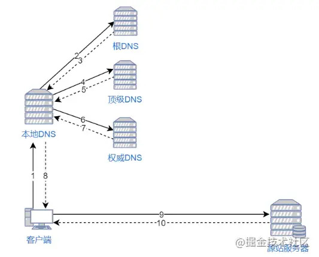
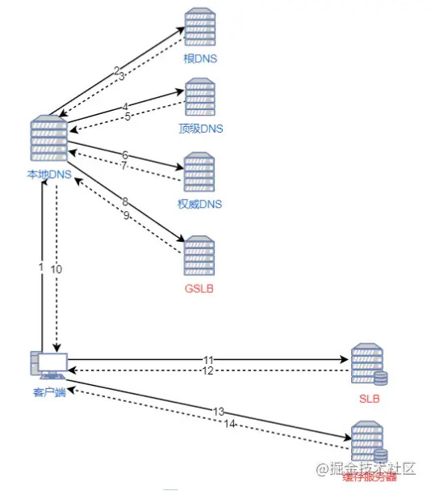

## 图片优化
### 概念
#### 有损压缩
指在压缩文件大小的过程中，损失了一部分图片的信息，也即降低了图片的质量，并且这种损失是不可逆的，我们不可能从有一个有损压缩过的图片中恢复出全来的图片。常见的有损压缩手段，是按照一定的算法将临近的像素点进行合并。
#### 无损压缩
只在压缩文件大小的过程中，图片的质量没有任何损耗。我们任何时候都可以从无损压缩过的图片中恢复出原来的信息。
#### 索引色
用一个数字来代表（索引）一种颜色，在存储图片的时候，存储一个数字的组合，同时存储数字到图片颜色的映射。这种方式只能存储有限种颜色，通常是256种颜色，对应到计算机系统中，使用一个字节的数字来索引一种颜色。
#### 直接色
使用四个数字来代表一种颜色，这四个数字分别代表这个颜色中红色、绿色、蓝色以及透明度。现在流行的显示设备可以在这四个维度分别支持256种变化，所以直接色可以表示2的32次方种颜色。当然并非所有的直接色都支持这么多种，为压缩空间使用，有可能只有表达红、绿、蓝的三个数字，每个数字也可能不支持256种变化之多。
#### 点阵（位）图
点阵图是由象素的排列来实现其显示效果的，每个象素有自己的颜色信息，在对点阵图进行编辑操作的时候，可操作的对象是每个象素，我们可以改变图像的色相、饱和度、明度，从而改变图像的显示效果。点阵图缩放会失真，用最近非常流行的沙画来比喻最恰当不过，当你从远处看的时候，画面细腻多彩，但是当你靠的非常近的时候，你就能看到组成画面的每粒沙子以及每个沙粒的颜色。
#### 矢量图
也叫做向量图。矢量图并不纪录画面上每一点的信息，而是纪录了元素形状及颜色的算法，当你打开一付矢量图的时候，软件对图形象对应的函数进行运算，将运算结果（图形的形状和颜色）显示给你看。无论显示画面是大还是小，画面上的对象对应的算法是不变的，所以，即使对画面进行倍数相当大的缩放，其显示效果仍然相同(不失真)。
### 常见图片格式和使用场景
#### BMP
BMP，是无损的、既支持索引色也支持直接色的点阵图。这种图片格式几乎没有对数据进行压缩，所以BMP格式的图片通常是较大的文件。
#### GIF
GIF 是无损的、采用索引色的点阵图。采用 LZW 压缩算法进行编码。文件小，是 GIF 格式的优点，同时，GIF 格式还具有支持动画以及透明的优点。但是 GIF 格式仅支持 8bit 的索引色，所以 GIF 格式适用于对色彩要求不高同时需要文件体积较小的场景。
#### JPEG
JPEG 是有损的、采用直接色的点阵图。JPEG 的图片的优点是采用了直接色，得益于更丰富的色彩，JPEG 非常适合用来存储照片，与 GIF 相比，JPEG 不适合用来存储企业 Logo、线框类的图。因为有损压缩会导致图片模糊，而直接色的选用，又会导致图片文件较 GIF 更大。
#### PNG-8
PNG-8 是无损的、使用索引色的点阵图。PNG 是一种比较新的图片格式，PNG-8 是非常好的 GIF 格式替代者，在可能的情况下，应该尽可能的使用 PNG-8 而不是 GIF，因为在相同的图片效果下，PNG-8 具有更小的文件体积。除此之外，PNG-8 还支持透明度的调节，而 GIF 并不支持。除非需要动画的支持，否则没有理由使用 GIF 而不是 PNG-8。
#### PNG-24
PNG-24 是无损的、使用直接色的点阵图。PNG-24 的优点在于它压缩了图片的数据，使得同样效果的图片，PNG-24 格式的文件大小要比 BMP 小得多。不过 PNG24 的图片还是要比 JPEG、GIF、PNG-8 大得多。
#### SVG
SVG 是无损的矢量图。SVG 是矢量图意味着 SVG 图片由直线和曲线以及绘制它们的方法组成。当放大 SVG 图片时，看到的还是线和曲线，而不会出现像素点。这意味着 SVG 图片在放大时，不会失真，所以它非常适合用来绘制 Logo、Icon 等。
#### WebP
WebP 是谷歌开发的一种新图片格式，WebP 是同时支持有损和无损压缩的、使用直接色的点阵图。从名字就可以看出来它是为 Web 而生的，什么叫为 Web 而生呢？就是说相同质量的图片，WebP 具有更小的文件体积。现在网站上充满了大量的图片，如果能够降低每一个图片的文件大小，那么将大大减少浏览器和服务器之间的数据传输量，进而降低访问延迟，提升访问体验。目前只有 Chrome 浏览器和 Opera 浏览器支持 WebP 格式，兼容性不太好。另外 WebP 格式的图片无法直接在 mac 上双击预览，需要安装相对应的插件，增加了使用成本。
### 如何对项目上的图片进行优化？
1. 不用图片。很多时候会使用到很多修饰类图片，其实这类修饰图片完全可以用 CSS 去代替，或者图标字体 iconfont 去代替。
2. 对于移动端来说，屏幕宽度就那么点，往往使用图片的某一部分，这个时候可以提前裁剪图片，请求裁剪好的小图。
3. 小图使用 base64 格式，减少 http 请求。
4. 将多个图标文件整合到一张图片中（雪碧图），减少 http 请求。
5. 选取正确的图片格式，在兼容性允许的情况下尽量使用 WebP 格式的图片。小图使用 PNG 或者 SVG 图片，照片使用 JPEG 格式。  
6. 必要的时候使用图片懒加载。


## HTTP请求
1. 减少 HTTP 请求  
一个完整的 HTTP 请求需要经历 DNS 查找，TCP 握手，浏览器发出 HTTP 请求，服务器接收请求，服务器处理请求并发回响应，浏览器接收响应等过程。在文件很小的情况下发送请求是很不划算的，此时我们可以减少发送的请求来提升相应的速度，例如将小图片改成 base64 格式。
2. 使用 HTTP/2.0  
HTTP/2.0 版本协议，支持多路复用，理论上 HTTP/2.0 协议支持在同一个 TCP 连接上发送无限个 HTTP 请求，且这些请求的生命期可以重叠，大大减少请求时间，在使用 HTTP/2.0 后小图就没必要使用 base64 了。


## webpack 的优化
1. 压缩代码
2. 使用 contenthash 作为文件名称的一部分，利于浏览器缓存
3. tree-shaking  
4. 分割代码，将第三方插件或公共代码单独提取出来打包
5. 异步模块，按需加载（例如 Vue 路由懒加载）


## 使用 CDN 加载静态资源
内容分发网络（CDN）是一组分布在多个不同地理位置的 Web 服务器。我们都知道，当服务器离用户越远时，延迟越高。CDN 就是为了解决这一问题，在多个位置部署服务器，让用户离服务器更近，从而缩短请求时间。
### CDN 原理
当用户访问一个网站时，如果没有 CDN，过程是这样的：
1. 浏览器要将域名解析为 IP 地址，所以需要向本地 DNS 发出请求。
2. 本地 DNS 依次向根服务器、顶级域名服务器、权限服务器发出请求，得到网站服务器的 IP 地址。
3. 本地 DNS 将 IP 地址发回给浏览器，浏览器向网站服务器 IP 地址发出请求并得到资源。
  

如果用户访问的网站部署了 CDN，过程是这样的：
1. 浏览器要将域名解析为 IP 地址，所以需要向本地 DNS 发出请求。
2. 本地 DNS 依次向根服务器、顶级域名服务器、权限服务器发出请求，得到全局负载均衡系统（GSLB）的 IP 地址。
3. 本地 DNS 再向 GSLB 发出请求，GSLB 的主要功能是根据本地 DNS 的 IP 地址判断用户的位置，筛选出距离用户较近的本地负载均衡系统（SLB），并将该 SLB 的 IP 地址作为结果返回给本地 DNS。
4. 本地 DNS 将 SLB 的 IP 地址发回给浏览器，浏览器向 SLB 发出请求。
5. SLB 根据浏览器请求的资源和地址，选出最优的缓存服务器发回给浏览器。
6. 浏览器再根据 SLB 发回的地址重定向到缓存服务器。
7. 如果缓存服务器有浏览器需要的资源，就将资源发回给浏览器。如果没有，就向源服务器请求资源，再发给浏览器并缓存在本地。



## 合理放置 CSS 和 JS 的位置
1. CSS 放在文件头部  
CSS 的加载不会阻塞 DOM 树的解析，但是会阻塞 DOM 树的渲染，也会阻塞 JS 的执行。我们将 CSS 放置在头部可以防止用户先看到没有样式的“丑陋”的页面，同时也可以尽快渲染出页面，呈现给用户。
2. 将 JS 放置到文件底部或加上 defer 属性  
JS 的执行会阻塞 DOM 树的解析，将 JS 放置到文件底部，等 HTML 和 CSS 解析完了再加载 JS 文件，可以尽早向用户呈现页面的内容。给 JS 加上 defer 属性会使其异步下载，延迟执行，效果和将 JS 放置到文件底部类似，理论上节约了异步下载的时间。


## 使用缓存
1. index.html 使用协商缓存  
我们项目每次打包后 index 页面名称都是不变的，所以要使用协商缓存每次去服务器效验是否需要更新。
2. 静态资源使用 contenthash 做文件名称，并使用强缓存  
静态资源往往不太容易改变，webpack 在打包时我们使用 contenthash 作为文件名称后，一旦内容改变了，文件名称也就改变了，强缓存也就失效了，所以理论上静态资源的强缓存时间可以很大。
3. 动静分离，减少缓存失效的次数  
使用 webpack 打包时可以使用 splitChunks 进行分包，例如将引入的库和业务代码分离，这样库文件的缓存就不容易失效了。

缓存相关的知识详见：[http-缓存](/http.html#http-缓存)


## 减少重绘和重排
1. 重绘  
当重新生成渲染树后，就要将渲染树每个节点绘制到屏幕，这个过程叫重绘。例如改变字体颜色，会导致重绘。
2. 重排  
当改变 DOM 元素位置或大小时，会导致浏览器重新生成渲染树，这个过程叫重排，重排一定会导致重绘。

重排和重绘这两个操作都是非常昂贵的，因为 JavaScript 引擎线程与 GUI 渲染线程是互斥，它们同时只能一个在工作。可以使用以下策略来减少重绘和重排：
+ 用 JavaScript 修改样式时，最好不要直接写样式，而是替换 class 来改变样式。
+ 如果要对 DOM 元素执行一系列操作，可以将 DOM 元素脱离文档流，修改完成后，再将它带回文档。推荐使用隐藏元素（display:none）或文档碎片（DocumentFragement），都能很好的实现这个方案。
+ 如果要插入大量 DOM 不要循环插入，使用文档碎片（DocumentFragement）包裹只插入一次。


## 使用事件委托
事件委托利用了事件冒泡，只指定一个事件处理程序，就可以管理某一类型的所有事件。不过现在各类框架已经解决了这个问题，详见：[什么是事件委托](/js.html#什么是事件委托)


## 大量计算使用 Web Workers
Web Worker 使用其他工作线程从而独立于主线程之外，它可以执行任务而不干扰用户界面。一个 worker 可以将消息发送到创建它的 JavaScript 代码, 通过将消息发送到该代码指定的事件处理程序（反之亦然）。Web Worker 适用于那些处理纯数据，或者与浏览器 UI 无关的长时间运行脚本。


## DNS-prefetch 和 Preconnect
当浏览器打开跨域外链（跳转到别的网页）的时候必须先将该域名解析为 IP 地址，然后浏览器才能发出请求。此过程称为 DNS 解析，[DNS-prefetch](https://developer.mozilla.org/zh-CN/docs/Web/Performance/dns-prefetch) (DNS 预获取) 是尝试在请求资源之前解析域名，之后打开可以加快网页的加载速度，注意 dns-prefetch 仅对跨域域上的 DNS 查找有效，非跨域在打开网页的时候就已经解析过了，不需要多此一举，使用方式如下：
```html
<head>
    <link rel="dns-prefetch" href="https://fonts.gstatic.com/">
</head>
```
考虑将 dns-prefetch 与 preconnect（预连接）提示配对。尽管 dns-prefetch 仅执行 DNS 查找，但 preconnect 会建立与服务器的连接。如果站点是通过 HTTPS 服务的，则此过程包括 DNS 解析，建立 TCP 连接以及执行 TLS 握手，将两者结合起来可提供进一步减少跨域请求的感知延迟的机会，如下所示：
```html
<head>
    <link rel="preconnect" href="https://fonts.gstatic.com/" crossorigin>
    <link rel="dns-prefetch" href="https://fonts.gstatic.com/">
</head>
```
一些资源，如字体，以匿名模式加载。在这种情况下，使用 preconnect 应该设置 crossorigin 属性。如果您省略它，浏览器将只执行DNS查找。
