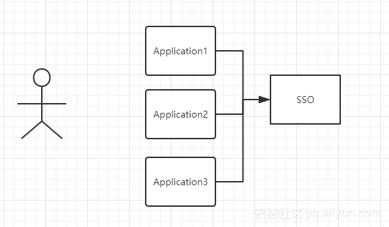
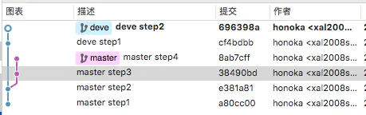
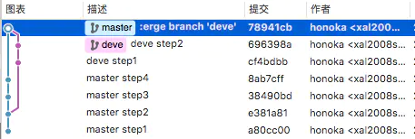
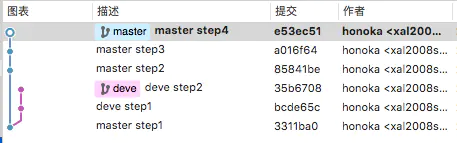
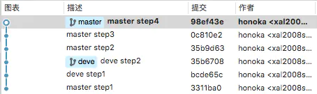

## 单点登录
### 概念
单点登录分为多个系统和一个认证系统SSO，如图：
  
图中有4个系统，分别是 Application1、Application2、Application3、和 SSO。Application1、Application2、Application3 没有登录模块，而 SSO 只有登录模块，没有其他的业务模块，当 Application1、Application2、Application3 需要登录时，将跳到 SSO 系统，SSO 系统完成登录，其他的应用系统也就随之登录了。
### 同域下的单点登录
利用 cookie 可以设置二级域名的特点达到 cookie 共享的目的。例如此时有三个域名：app1.a.com，app2.a.com，sso.a.com。当用户在 app1.a.com 系统中的 session 中查找不到时，会请求 sso.a.com 的接口，来判断用户是否登录，因为之前登录会在 sso.a.com 中设置二级域名的 cookie（在这里是.a.com），所以该请求会携带对应的 cookie，sso.a.com 系统拿到 cookie 后会在自己的 session 中查找是否存在，存在则返回 session 给 app1.a.com 系统同步，否则让用户跳转到 sso.a.com 系统进行登录。
### 不同域下的单点登录
不同域下的单点登录参考 CAS 官网上的标准流程，具体流程如下：  
1. 用户访问 app 系统，app 系统是需要登录的，但用户现在没有登录。
2. 跳转到 SSO 登录系统，SSO 系统也没有登录，弹出用户登录页。
3. 用户填写用户名、密码，SSO 系统进行认证后，将登录状态写入 SSO 的 session，浏览器（Browser）中写入 SSO 域下的 Cookie。
4. SSO 系统登录完成后会生成一个 ST（Service Ticket），然后跳转到 app 系统，同时将 ST 作为参数传递给 app 系统。
5. app 系统拿到 ST 后，从后台向 SSO 发送请求，验证 ST 是否有效。
6. 验证通过后，app 系统将登录状态写入 session 并设置 app 域下的 Cookie。

至此，跨域单点登录就完成了。以后我们再访问 app 系统时，app 就是登录的。接下来，我们再看看访问 app2 系统时的流程。用户访问 app2 系统，app2 系统没有登录，跳转到 SSO。
1. 由于 SSO 已经登录了，不需要重新登录认证。
2. SSO 生成 ST，浏览器跳转到 app2 系统，并将ST作为参数传递给 app2。
3. app2 拿到 ST，后台访问 SSO，验证 ST 是否有效。
4. 验证成功后，app2 将登录状态写入 session，并在 app2 域下写入 Cookie。  

这样，app2 系统不需要走登录流程，就已经是登录了。SSO，app 和 app2 在不同的域，它们之间的 session 不共享也是没问题的。  
参考链接：[https://developer.aliyun.com/article/636281](https://developer.aliyun.com/article/636281)


## 正则表达式
笔记如下：
<div align="center">
  
  
</div>


## Ascii、GBK、UTF、Unicode
+ Ascii（1个字节1个字符）
+ GBK 是国内的编码标准（汉字2个字节）
+ Unicode 是国际编码标准（统一2个字节表示一个字符）
+ UTF 是 Unicode 实现方式之一
> unicode同样也不完美，这里就有两个的问题，一个是，如何才能区别unicode和ascii？  
> 由于”半角”英文符号只需要用到低8位，所以其高8位永远是0，因此这种大气的方案在保存英文文本时会多浪费一倍的空间  
> unicode在很长一段时间内无法推广，直到互联网的出现，为解决unicode如何在网络上传输的问题，于是面向传输的众多 UTF（UCS Transfer Format）标准出现了，顾名思义，UTF-8就是每次8个位传输数据，而UTF-16就是每次16个位。UTF-8就是在互联网上使用最广的一种unicode的实现方式，这是为传输而设计的编码，并使编码无国界，这样就可以显示全世界上所有文化的字符了。UTF-8最大的一个特点，就是它是一种变长的编码方式。它可以使用1~4个字节表示一个符号，根据不同的符号而变化字节长度，当字符在ASCII码的范围时，就用一个字节表示，保留了ASCII字符一个字节的编码做为它的一部分，注意的是unicode一个中文字符占2个字节，而UTF-8一个中文字符占3个字节）。从unicode到utf-8并不是直接的对应，而是要过一些算法和规则来转换。

推荐链接：[http://www.ruanyifeng.com/blog/2007/10/ascii_unicode_and_utf-8.html](http://www.ruanyifeng.com/blog/2007/10/ascii_unicode_and_utf-8.html)


## git merge 和 git rebase区别
### git merge
例如我们当前的分支情况如下图:  
  
在 master 分支执行 git merge dev 会将 dev 分支合并到当前分支，并生产一个新的提交，如下图：  
  
### git rebase
例如我们当前的分支情况如下图:  
  
在 master 分支执行 git rebase dev 会以当前分支与 dev 分支分开的点开始（3311ba0），抹去之后的提交，依次生成合并后的提交，如下图：  
  
### 总结
如果你想要一个干净的，没有 merge commit 的线性历史树，那么你应该选择 git rebase  
如果你想保留完整的历史记录，并且想要避免重写 commit history 的风险，你应该选择使用 git merge  


## 为什么引用值要放在堆中，而原始值要放在栈中
堆比栈大，栈比堆的运算速度快，对象是一个复杂的结构，并且可以自由扩展，如：数组可以无限扩充，对象可以自由添加属性。将他们放在堆中是为了不影响栈的效率。而是通过引用的方式查找到堆中的实际对象再进行操作。相对于简单数据类型而言，简单数据类型就比较稳定，并且它只占据很小的内存。不将简单数据类型放在堆是因为通过引用到堆中查找实际对象是要花费时间的，而这个综合成本远大于直接从栈中取得实际值的成本。所以简单数据类型的值直接存放在栈中。


## Nginx 常见配置
### 代理接口
```
location /front-end/ {
  proxy_pass http://192.168.9.149:8081;
}
```

### 添加请求头
```
location /front-end/ {
  add_header Cache-Control no-cache;
}
```

### try_files 和 index 用法
```
location /front-end/ {
  try_files $uri $uri/ /front-end/index.html;
  index index.html;
}
```
location 里的 try_files 的作用是设置文件获取的尝试路径。  
location 里的 index 的作用是指定该文件夹下默认匹配的文件，在查找文件夹时，会查找该文件夹下默认匹配的文件。  

### location 配置
#### 语法规则
location [ = | ~ | ~* | ^~ | !~ | !~* ] /uri/ { … }
|模式|含义|
|-|-|
|location = /uri|	= 表示精确匹配
|location ^~ /uri|	^ 进行前缀匹配，~ 表示区分大小写
|location ~ pattern &nbsp;&nbsp;&nbsp;&nbsp;&nbsp;&nbsp;|	~ 区分大小写的匹配
|location ~* pattern|	~* 不区分大小写的匹配
|location /uri|	不带任何修饰符，也表示前缀匹配，但是在正则匹配之后
|location /|	通用匹配，任何未匹配到其它 location 的请求都会匹配到，相当于 switch 中的 default
|location !~|	区分大小写不匹配
|location !~*|	不区分大小写不匹配
#### 匹配优先级
+ 首先精确匹配 =
+ 其次前缀匹配 ^~
+ 其次是按文件中顺序的正则匹配
+ 然后匹配不带任何修饰的前缀匹配
+ 最后是交给 / 通用匹配
+ 当有匹配成功时候，停止匹配，按当前匹配规则处理请求

匹配的时候依照最佳匹配规则，按照能匹配到的最多的规则进行匹配，如 location ^~ /test/react/ 和 location ^~ /test/，请求 http://localhost/test/react/react.dev.js，会匹配 location /test/react/

### 负载均衡配置
```
http {
  #在http字段添加
  upstream servers.mydomain.com {
    server 192.168.2.3:80;
    server 192.168.2.4:80; 
    ip_hash;  #nginx 的 upstream 目前支持 ip_hash 模式，每个请求按访问 ip 的 hash 结果分配，这样每个访客固定访问一个后端服务器，可以解决 session 的问题。
  }
  server{ 
    listen 80; 
    server_name www.mydomain.com; 
    location / {
      proxy_pass http://servers.mydomain.com; 
      proxy_set_header Host $host; 
      proxy_set_header X-Real-IP $remote_addr; 
      proxy_set_header X-Forwarded-For $proxy_add_x_forwarded_for; 
    } 
  } 
}
```


## MVC、MCP、MVVM 的区别
### MVC
  
MVC 是比较经典的软件架构，总体的流程是：View 传送指令到 Controller，Controller 完成业务逻辑后，要求 Model 改变状态，Model 将新的数据发送到 View，用户得到反馈，所有通信都是单向的。

### MVP
  
MVP 是由 MVC 演化而来，其特点是 View 和 Model 层无法直接通信，而是通过中间层 Presenter 传递，一定程度简化了复杂性。View 非常薄，不部署任何业务逻辑，称为 "被动视图"（Passive View），即没有任何主动性，而 Presenter 非常厚，所有逻辑都部署在那里，我们需要手动做许多 View 层和 Model 层数据同步的操作。

### MVVM
  
和 MVP 相似，MVVM 的 View 和 Model 层也无法直接通信，而是通过 ViewModel 来通信的。与 MVP 不同的是 MVVM 的 ViewModel 往往是框架提供的（例如 vue），不再需要自己手动同步。用户只需要关注 View 层和 Model 层的逻辑，大大的简化了复杂性。