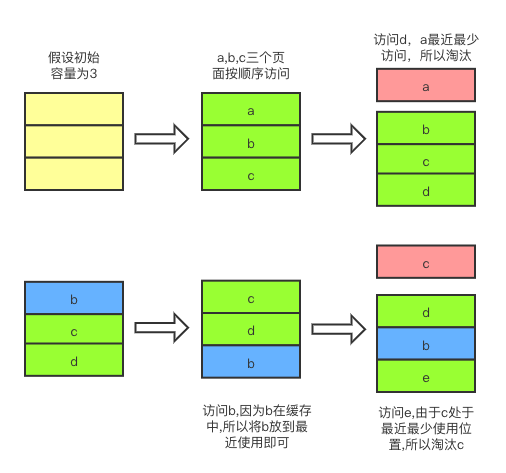

## 单点登录
### 概念
单点登录分为多个系统和一个认证系统SSO，如图：
  
图中有4个系统，分别是 Application1、Application2、Application3、和 SSO。Application1、Application2、Application3 没有登录模块，而 SSO 只有登录模块，没有其他的业务模块，当 Application1、Application2、Application3 需要登录时，将跳到 SSO 系统，SSO 系统完成登录，其他的应用系统也就随之登录了。
### 同域下的单点登录
利用 cookie 可以设置二级域名的特点达到 cookie 共享的目的。例如此时有三个域名：app1.a.com，app2.a.com，sso.a.com。当用户在 app1.a.com 系统中的 session 中查找不到时，因为之前登录会在 sso.a.com 中设置二级域名的 cookie（在这里是.a.com），所以 app1.a.com 的请求就可以拿到该 cookie，接着用该 cookie 请求 sso.a.com 的接口，sso.a.com 系统拿到 cookie 后会在自己的 session 中查找是否存在，存在则返回 session 给 app1.a.com 系统同步，否则让用户跳转到 sso.a.com 系统进行登录。
### 不同域下的单点登录
不同域下的单点登录参考 CAS 官网上的标准流程，具体流程如下：  
1. 用户访问 app 系统，app 系统是需要登录的，但用户现在没有登录。
2. 跳转到 SSO 登录系统，SSO 系统也没有登录，弹出用户登录页。
3. 用户填写用户名、密码，SSO 系统进行认证后，将登录状态写入 SSO 的 session，浏览器（Browser）中写入 SSO 域下的 Cookie。
4. SSO 系统登录完成后会生成一个 ST（Service Ticket），然后跳转到 app 系统，同时将 ST 作为参数传递给 app 系统。
5. app 系统拿到 ST 后，从后台向 SSO 发送请求，验证 ST 是否有效。
6. 验证通过后，app 系统将登录状态写入 session 并设置 app 域下的 Cookie。

至此，跨域单点登录就完成了。以后我们再访问 app 系统时，app 就是登录的。接下来，我们再看看访问 app2 系统时的流程。用户访问 app2 系统，app2 系统没有登录，跳转到 SSO。
1. 由于 SSO 已经登录了，不需要重新登录认证。
2. SSO 生成 ST，浏览器跳转到 app2 系统，并将 ST 作为参数传递给 app2。
3. app2 拿到 ST，后台访问 SSO，验证 ST 是否有效。
4. 验证成功后，app2 将登录状态写入 session，并在 app2 域下写入 Cookie。  

这样，app2 系统不需要走登录流程，就已经是登录了。SSO，app 和 app2 在不同的域，它们之间的 session 不共享也是没问题的。  
参考链接：
+ [https://developer.aliyun.com/article/636281](https://developer.aliyun.com/article/636281)
+ [微服务登录流程分析](https://github.com/NameWjp/blog/issues/87)


## 正则表达式
正则表达式默认的是贪婪匹配（尽可能多的匹配），如果想变成非贪婪匹配，可以在后面接上 ?，例如：`+?`，`??`，`*?`，`{n,}?`，`{n,m}?`
### 字符
|字符|描述|
|-|-|
|\\|转义字符，通常在 \ 后面的字符不按原来的意义解释|
|.|任意字符|
|^|匹配行首|
|$|匹配结尾|
|[a-z]|匹配 a~z 范围的字符|
|[A-Z]|匹配 A~Z 范围的字符|
|[0-9]|匹配 0~9 范围的字符|
|\d|匹配一个数字，同[0-9]|
|\D|匹配一个非数字，同[^0-9]|
|\w|匹配字母、数字、下划线，同[A-Za-z0-9_]|
|\W|匹配非字母、数字、下划线，同[^A-Za-z0-9_]|
|\n|匹配一个换行符|
|\r|匹配一个回车|
|\s|匹配一个空白符，同[\f\n\r\t\v]|
|\S|匹配一个非空白符，同[^\f\n\r\t\v]|
|\b|匹配一个单词边界，例：er\b 可以匹配 'never' 中的 'er'，但不能匹配 'verb' 中的 'er'|
|\B|匹配一个非单词边界，例：er\B 可以匹配 'verb' 中的 'er'，但不能匹配 'never' 中的 'er'|
### 规则
|字符|描述|
|-|-|
|(...)|捕获分组，match 或 replace 中的 $1 等可以获取|
|[]|定义匹配字符的范围|
|{}|定义匹配的长度|
|[^...]|匹配非中括号里的内容|
|*|0 个或任意多个字符|
|+|至少一个字符，同`{1,}`|
|?|匹配 0 个或一个字符，同`{0,1}`|
|{n}|匹配 n 次字符|
|{n,}|匹配至少 n 次字符|
|{n,m}|匹配 n 到 m 次字符|
|x \| y|匹配 x 或 y 字符|
|(?:pattern)|非获取匹配，例：industr(?:y|ies) 就是一个比 industry|industries 更简略的表达式。|
### 预查
预查也叫环视，环视匹配的是位置，不会消耗字符，也就是说，在检查环视表达式能否匹配的过程中，环视本身不会消耗任何文本。举例说明，对于普通正则表达式 ”Jeffrey”，在匹配文本 ”… by Jeffrey Friedl.” 时，匹配到的结果是：  
  
如果使用用环视“(?=Jeffery)” 匹配到的位置如下：   
  
顺序环视会检查表达式能否匹配，但它只寻找匹配的位置，而不会消耗这些字符。用环视和普通正则表达式结合起来，可以得到更精确的匹配，如 “(?=Jeffery)Jeff” 表示只能匹配 ”Jeffery” 这个单词中的 ”Jeff”。
|字符|描述|
|-|-|
|(?=pattern)&nbsp; &nbsp; &nbsp; &nbsp;|正向肯定预查，向右，例："Windows(?=95\|98\|NT\|2000)" 能匹配 "Windows2000" 中的 "Windows"，但不能匹配 "Windows3.1" 中的 "Windows"|
|(?!pattern)|正向否定预查，向右，例："Windows(?!95\|98\|NT\|2000)" 能匹配 "Windows3.1" 中的 "Windows"，但不能匹配 "Windows2000" 中的 "Windows"|
|(?<=pattern)|反向肯定预查，向左，例："(?<=95\|98\|NT\|2000)Windows" 能匹配 "2000Windows" 中的 "Windows"，但不能匹配 "3.1Windows" 中的 "Windows"|
|(?<!pattern)|反向否定预查，向左，例："(?<!95\|98\|NT\|2000)Windows" 能匹配 "3.1Windows" 中的 "Windows"，但不能匹配 "2000Windows" 中的 "Windows"|

## Ascii、GBK、UTF、Unicode
+ Ascii（1个字节1个字符）
+ GBK 是国内的编码标准（汉字2个字节）
+ Unicode 是国际编码标准（统一2个字节表示一个字符）
+ UTF 是 Unicode 实现方式之一
Unicode 同样也不完美，这里就有两个的问题：
  1. 如何才能区别 Unicode 和 Ascii ？
  2. 由于”半角”英文符号只需要用到低8位，所以其高8位永远是0，因此这种大气的方案在保存英文文本时会多浪费一倍的空间  
  
Unicode 在很长一段时间内无法推广，直到互联网的出现，为解决 Unicode 如何在网络上传输的问题，于是面向传输的众多 UTF（UCS Transfer Format）标准出现了，顾名思义，UTF-8 就是每次8个位传输数据，而 UTF-16 就是每次16个位。UTF-8 就是在互联网上使用最广的一种 Unicode 的实现方式，这是为传输而设计的编码，并使编码无国界，这样就可以显示全世界上所有文化的字符了。UTF-8 最大的一个特点，就是它是一种变长的编码方式。它可以使用1~4个字节表示一个符号，根据不同的符号而变化字节长度，当字符在 Ascii 码的范围时，就用一个字节表示，保留了 Ascii 字符一个字节的编码做为它的一部分，注意的是 Unicode 一个中文字符占2个字节，而 UTF-8 一个中文字符占3个字节）。从 Unicode 到 UTF-8 并不是直接的对应，而是要过一些算法和规则来转换。

推荐链接：[http://www.ruanyifeng.com/blog/2007/10/ascii_unicode_and_utf-8.html](http://www.ruanyifeng.com/blog/2007/10/ascii_unicode_and_utf-8.html)


## git merge 和 git rebase区别
### git merge
例如我们当前的分支情况如下图:  
  
在 master 分支执行 git merge dev 会将 dev 分支合并到当前分支，并生产一个新的提交，如下图：  
  
### git rebase
例如我们当前的分支情况如下图:  
  
在 master 分支执行 git rebase dev 会以当前分支与 dev 分支分开的点开始（3311ba0），抹去之后的提交，依次生成合并后的提交，如下图：  
  
### 总结
如果你想要一个干净的，没有 merge commit 的线性历史树，那么你应该选择 git rebase  
如果你想保留完整的历史记录，并且想要避免重写 commit history 的风险，你应该选择使用 git merge  


## 为什么引用值要放在堆中，而原始值要放在栈中
1. 程序按照一定的顺序进出栈，每个栈的内存空间需要是已知的，假设是未知的话则没法正确的出栈，所以对象数组这类引用类型的数据大小是未知的，不能够放到栈中。  
2. 栈运行在 CPU 的高速缓存中，速度更快（是内存的 10 倍以上），但空间更小，适合放原始类型等占用空间小的数据。堆运行在内存中，空间大但速度相对较慢，适合放占用空间大的数据。  


## Nginx 常见配置
### 代理接口
```
location /front-end/ {
  proxy_pass http://192.168.9.149:8081;
}
```

### 添加请求头
```
location /front-end/ {
  add_header Cache-Control no-cache;
}
```

### try_files 和 index 用法
```
location /front-end/ {
  try_files $uri $uri/ /front-end/index.html;
  index index.html;
}
```
location 里的 try_files 的作用是设置文件获取的尝试路径。  
location 里的 index 的作用是指定该文件夹下默认匹配的文件，在查找文件夹时，会查找该文件夹下默认匹配的文件。  

### location 配置
#### 语法规则
location [ = | ~ | ~* | ^~ | !~ | !~* ] /uri/ { … }
|模式|含义|
|-|-|
|location = /uri|	= 表示精确匹配
|location ^~ /uri|	^ 进行前缀匹配，~ 表示区分大小写
|location ~ pattern &nbsp;&nbsp;&nbsp;&nbsp;&nbsp;&nbsp;|	~ 区分大小写的正则匹配
|location ~* pattern|	~* 不区分大小写的正则匹配
|location /uri|	不带任何修饰符，也表示前缀匹配，但是在正则匹配之后
|location /|	通用匹配，任何未匹配到其它 location 的请求都会匹配到，相当于 switch 中的 default
|location !~|	区分大小写不匹配
|location !~*|	不区分大小写不匹配
#### 匹配优先级
+ 首先精确匹配 =
+ 其次前缀匹配 ^~
+ 其次是按配置文件中的顺序的正则匹配
+ 然后匹配不带任何修饰的前缀匹配
+ 最后是交给 / 通用匹配
+ 当有匹配成功时候，停止匹配，按当前匹配规则处理请求

匹配的时候依照最佳匹配规则，按照能匹配到的最多的规则进行匹配，如 location ^~ /test/react/ 和 location ^~ /test/，请求 http://localhost/test/react/react.dev.js，会匹配 location /test/react/

### 负载均衡配置
```
http {
  #在http字段添加
  upstream servers.mydomain.com {
    server 192.168.2.3:80;
    server 192.168.2.4:80; 
    ip_hash;  #nginx 的 upstream 目前支持 ip_hash 模式，每个请求按访问 ip 的 hash 结果分配，这样每个访客固定访问一个后端服务器，可以解决 session 的问题。
  }
  server{ 
    listen 80; 
    server_name www.mydomain.com; 
    location / {
      proxy_pass http://servers.mydomain.com; 
      proxy_set_header Host $host; 
      proxy_set_header X-Real-IP $remote_addr; 
      proxy_set_header X-Forwarded-For $proxy_add_x_forwarded_for; 
    } 
  } 
}
```


## MVC、MCP、MVVM 的区别
### MVC
  
MVC 是比较经典的软件架构，总体的流程是：View 传送指令到 Controller，Controller 完成业务逻辑后，要求 Model 改变状态，Model 将新的数据发送到 View，用户得到反馈，所有通信都是单向的。

### MVP
  
MVP 是由 MVC 演化而来，其特点是 View 和 Model 层无法直接通信，而是通过中间层 Presenter 传递，一定程度简化了复杂性。View 非常薄，不部署任何业务逻辑，称为 "被动视图"（Passive View），即没有任何主动性，而 Presenter 非常厚，所有逻辑都部署在那里，我们需要手动做许多 View 层和 Model 层数据同步的操作。

### MVVM
  
和 MVP 相似，MVVM 的 View 和 Model 层也无法直接通信，而是通过 ViewModel 来通信的。与 MVP 不同的是 MVVM 的 ViewModel 往往是框架提供的（例如 vue），不再需要自己手动同步。用户只需要关注 View 层和 Model 层的逻辑，大大的简化了复杂性。


## 观察者模式和发布订阅模式的区别
 
观察者模式里，订阅者和发布者是松耦合的关系，一个发布者对应多个订阅者。发布订阅模式里，订阅者和发布者完全解耦，订阅者和发布者通过中间人联系。


## 常见的缓存淘汰算法有哪些
### FIFO（First In First Out）
最简单的页面置换算法是先入先出（FIFO）法。这种算法的实质是，总是选择在主存中停留时间最长（即最老）的一页置换，即先进入内存的页，先退出内存。理由是：最早调入内存的页，其不再被使用的可能性比刚调入内存的可能性大。建立一个 FIFO 队列，收容所有在内存中的页。被置换页面总是在队列头上进行。当一个页面被放入内存时，就把它插在队尾上。
### LRU（Least Recently Used）
   
最近最少使用策略，不难从字面去理解，就是当一个页面最近最少使用，那么当内存溢出，缓存中淘汰的就是最近最少使用的页面。这也是 Vue 中 keep-alive 默认的缓存淘汰算法，具体代码如下：
```js
render() {
    const slot = this.$slots.default
    const vnode: VNode = getFirstComponentChild(slot)
    const componentOptions: ?VNodeComponentOptions = vnode && vnode.componentOptions
    if (componentOptions) {
        // check pattern
        const name: ?string = getComponentName(componentOptions)
        const { include, exclude } = this
        if (
            // not included
            (include && (!name || !matches(include, name))) ||
            // excluded
            (exclude && name && matches(exclude, name))
        ) {
            return vnode
        }

        const { cache, keys } = this
        const key: ?string = vnode.key == null
            // same constructor may get registered as different local components
            // so cid alone is not enough (#3269)
            ? componentOptions.Ctor.cid + (componentOptions.tag ? `::${componentOptions.tag}` : '')
            : vnode.key
        if (cache[key]) {
            vnode.componentInstance = cache[key].componentInstance
            // 如果缓存已经存在，则把它放到最前面
            remove(keys, key)
            keys.push(key)
        } else {
            cache[key] = vnode
            // 否则直接放到最后面
            keys.push(key)
            // prune oldest entry
            if (this.max && keys.length > parseInt(this.max)) {
                pruneCacheEntry(cache, keys[0], keys, this._vnode)
            }
        }

        vnode.data.keepAlive = true
    }
    return vnode || (slot && slot[0])
}
```
### LFU（Least Frequently Used）
最近最少使用算法，它是基于如果一个数据在最近一段时间内使用次数很少，那么在将来一段时间内被使用的可能性也很小的思路。乍然一看，好像 LFU 跟 LRU 没什么不同，其实，最核心的判断就不同了。**LRU 的淘汰规则是基于访问时间，而 LFU 是基于访问次数的**。例子，假设缓存大小为 3，数据访问序列为：
```js
set(2,2)
set(1,1)
get(2)
get(1)
get(2)
set(3,3)
set(4,4)
```
则在 set(4,4) 时对于 LFU 算法应该淘汰 (3,3)，而LRU应该淘汰 (1,1)。因为根据 LFU 的核心，在堆栈满载之后，1 访问了 1 次，2 访问了 2 次，虽然 3 是最后才加进来的，但是访问次数为 0，最少访问，所以 LFU 淘汰的是 (3,3)。
### OPT（Optimal）
这是一种理想情况下的页面置换算法，但实际上是不可能实现的。该算法的基本思想是：发生缺页时，有些页面在内存中，其中有一页将很快被访问（也包含紧接着的下一条指令的那页），而其他页面则可能要到 10、100 或者 1000 条指令后才会被访问，每个页面都可以用在该页面首次被访问前所要执行的指令数进行标记。最佳页面置换算法只是简单地规定：标记最大的页应该被置换。这个算法唯一的一个问题就是它无法实现。当缺页发生时，操作系统无法知道各个页面下一次是在什么时候被访问。虽然这个算法不可能实现，但是最佳页面置换算法可以用于对可实现算法的性能进行衡量比较。

参考：[缓存算法(页面置换算法)之LRU算法](https://segmentfault.com/a/1190000022481934)
