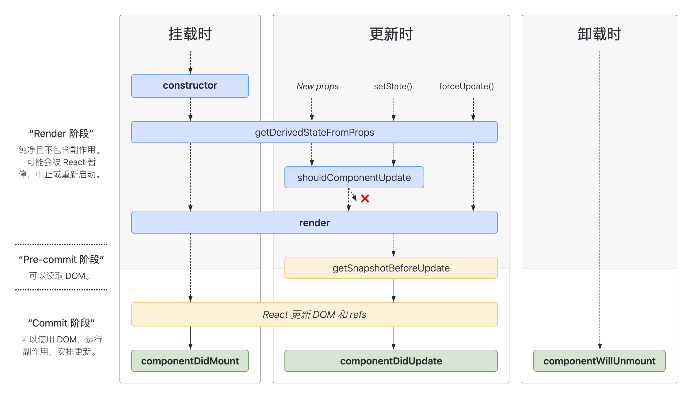
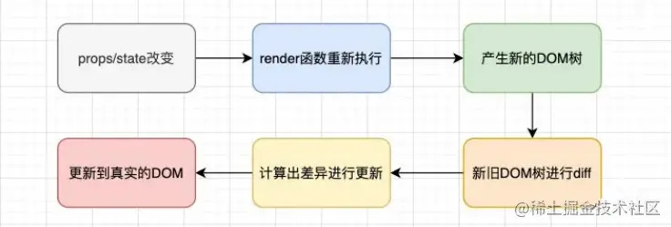

## hooks 的出现解决了什么问题？
个人认为 React hooks 的出现主要解决了两个问题。
1. 逻辑割裂  
在 hooks 出现之前，React 主要通过编写 class 类来编写组件，每个组件有自己的生命周期，这就导致我们在编码时必须按照组件的生命周期去写，例如：我们在 `componentDidMount` 注册一个定时去，在 `componentWillUnmount` 销毁定时器。在 `componentDidMount` 中请求数据，在 `componentDidUpdate` 中判断状态变化请求数据。同样的逻辑， 我们需要在不同的生命周期中去实现，在一个大型的 app 中，类似的逻辑会有很多，掺杂在一起，越来越难以维护。
2. 逻辑复用  
在 hooks 出现之前，复用逻辑的方式主要是`高阶函数`和`Render Props`，但这两种模式都有它们自己的问题，那就是会出现「嵌套地域」。  
对于高阶组件，我门的实现方式往往实现一个函数，它接受一个类并返回一个新类。这种方法确实可以很巧妙的解决一些逻辑复用的问题，但有一个弊端，如果一个组件被包裹很多层就会出现下面的情况：
```js
export default withA(
  withB (
    withC (
      withD (
        Component
      )
    )
  )
)
```
Render Props 也一样，这两种模式都会限制你的组件结构，随着功能的增加，包裹的层数越来越多，陷入所谓的 `wrapper hell` 之中。  
Hooks 的出现是一种全新的写法，抛弃了类，使用函数来写组件。但由于函数没法保存状态，React 引入了 `useState` 等 API 来帮助我们保留状态。其中的原理是 React 会根据 `useState` 的调用顺序来在内部保留状态，所以 Hooks 有一个重要的规则，只能在最顶层使用 Hooks。使用 Hooks 编写的代码没有「嵌套地狱」，组织代码粒度更细，相关逻辑代码紧密，提升了组件的内聚性，减少了维护成本。


## React 的生命周期有哪些？
React 生命周期图谱如下：

根据不同状态可以细分如下：  
### 挂载
1. constructor()  
在 React 组件挂载之前，会调用它的构造函数
2. static getDerivedStateFromProps()  
getDerivedStateFromProps 会在调用 render 方法之前调用，并且在初始挂载及后续更新时都会被调用，它应返回一个对象来更新 state（注意这里是静态方法，代表你不能访问 this，使得 getDerivedStateFromProps 这个函数强迫变成一个纯函数，逻辑也相对简单，就没那么多错误了）。
3. render()  
渲染函数 render() 被调用
4. componentDidMount()  
componentDidMount() 会在组件挂载后（插入 DOM 树中）立即调用。依赖于 DOM 节点的初始化应该放在这里。如需通过网络请求获取数据，此处是实例化请求的好地方。
### 更新
1. static getDerivedStateFromProps()  
2. shouldComponentUpdate()  
根据 shouldComponentUpdate() 的返回值，判断 React 组件是否受当前 state 或 props 更改的影响。默认父组件的 state 或 prop 更新时，无论子组件的 state、prop 是否更新，都会触发子组件的更新，这会形成很多没必要的 render，浪费很多性能，使用 shouldComponentUpdate 可以优化掉不必要的更新。
3. render()
4. getSnapshotBeforeUpdate()  
getSnapshotBeforeUpdate() 在最近一次渲染输出（提交到 DOM 节点）之前调用。它使得组件能在发生更改之前从 DOM 中捕获一些信息（例如，滚动位置）。此生命周期的任何返回值将作为参数传递给 componentDidUpdate()。
5. componentDidUpdate()  
componentDidUpdate() 会在更新后会被立即调用。
### 卸载
1. componentWillUnmount()  
componentWillUnmount() 会在组件卸载及销毁之前直接调用。在此方法中执行必要的清理操作，例如，清除 timer 等。
### 错误处理
1. static getDerivedStateFromError()  
此生命周期会在后代组件抛出错误后被调用。 它将抛出的错误作为参数，并返回一个值以更新 state
2. componentDidCatch()  
此生命周期在后代组件抛出错误后被调用。


## PureComponent 和 Component 区别
当使用 component 时，父组件的 state 或 prop 更新时，无论子组件的 state、prop 是否更新，都会触发子组件的更新，这会形成很多没必要的 render，浪费很多性能。pureComponent 的优点在于：pureComponent 在 shouldComponentUpdate 只进行浅层的比较，只要外层对象没变化，就不会触发render，减少了不必要的render。


## 如何使用 Context 上下文
1. 创建一个 context 对象
```js
const ThemeContext = React.createContext({
  theme: themes.dark,
  toggleTheme: () => {},
});
```
2. 使用 context.Provider 提供数据
```js
render() {
  return (
    <ThemeContext.Provider value={this.state}>
      <Content />
    </ThemeContext.Provider>
  );
}
```
3. 使用 context.Consumer 或者挂载 contextType 消费数据
```js
// context.Consumer
render() {
  return (
    <ThemeContext.Consumer>
      {({theme, toggleTheme}) => (
        <button
          onClick={toggleTheme}
          style={{backgroundColor: theme.background}}>
          Toggle Theme
        </button>
      )}
    </ThemeContext.Consumer>
  );
}

// 挂载 contextType
class MyClass extends React.Component {
  ...
  render() {
    let value = this.context;
  }
}
MyClass.contextType = ThemeContext;
```
需要注意的是 Provider 必须是 Consumer 的祖先元素。


## React 组件更新流程
