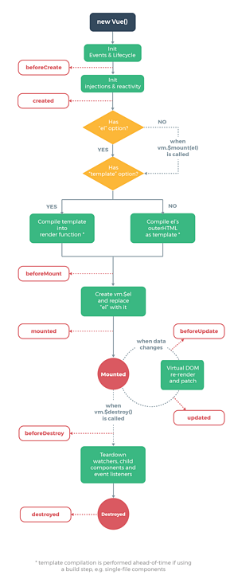
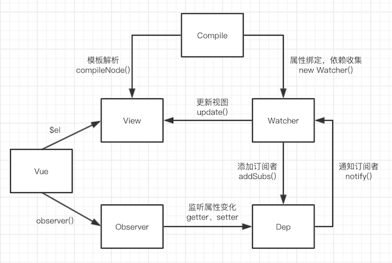
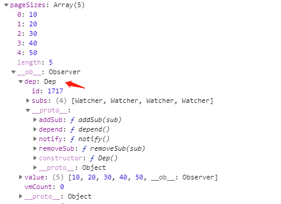

## vue 的生命周期有哪些
  
vue 的生命周期如图，总结如下：
1. beforeCreate  
只初始化一些事件，data 数据没有初始化，无法访问。
2. created  
data 数据已经初始化，可以访问，但此时的 dom 没有挂载，可以在这里进行请求服务器数据等操作。
3. beforeMount  
dom 挂载，但是 dom 中存在类似 {{ xxx }} 的占位符，并没有替换。
4. mounted  
此时组件渲染完毕，占位符也都被替换。
5. beforeUpdate 和 updated  
组件触发更新时，会立刻先调用 beforeUpdate，等到重新渲染完之后调用 updated 钩子
6. beforeDestroy 和 destroyed  
组件在销毁前会调用 beforeDestroy 钩子，可以在这里进行一些定时器或者销毁操作。destroyed 钩子函数会在 Vue 实例销毁后调用。
7. activated 和 deactivated  
如果组件被 keep-alive 包裹，第一次渲染会在 mounted 钩子后面调用 activated 钩子，离开的时候不会调用 beforeDestroy 和 destroyed 钩子，而是调用 deactivated 钩子，等到再切换回来的时候，activated 钩子会调用（不会再走 mounted 钩子）。
8. errorCaptured  
用于捕获子组件中抛出的错误，注意只有 errorCaptured 返回 false 则可以阻止错误继续向上传播（本质上是说“这个错误已经被搞定了且应该被忽略”）。
## Vue 响应式原理
  
Vue 的初始化如图所示，在执行 Observer 的时候会给 data 中的每个对象和数组添加一个 `__ob__` 属性，其中有一个 dep 属性，dep 是类 Dep 的实例，而 Dep 类内部实现了一套发布订阅的模式。之后又会递归遍历 data 中的对象和数组，将对象的 key 全部通过 Object.defineProperty 定义，拦截对象的 get 和 set，在 get 中通过 depend（这里在源码里有点绕，其实是先调用 dep 的 depend 方法，该方法会调用当前 watcher 的 addDep 方法，并将当前 dep 传过去，watcher 的 addDep 实际就是执行了 dep 的 addSub 方法将自己 push 进去） 将当前 watcher（后面解释它的意义）push 到一个数组中，完成了订阅。set 中通过遍历之前的数组，触发每个 watcher 的 update，从而派发更新。对于数组，由于数组是引用类型，对数组的 push 等方法并不会触发对象的 set，这里采用的是代理模式，拦截数组的原型，在 push 等改变数组方法调用时，手动派发更新。
`__ob__`属性如下：  
  
最后说下 Watcher，在 Vue 中 watcher 有三种：render watcher/ computed watcher/ user watcher(就是vue方法中的那个watch)，Watcher 类的作用是 vm 实例和 Observer 的桥梁，负责管理 dep，vm 等。比如 Observer 的 set 方法触发了 watcher 的 update 去更新， watcher 的 update 会调用 vm 的 _update 从而更新视图。

## Vue3 和 Vue2 的区别
Vue3 除了性能提升外，相比 Vue2 有以下特点：  
1. 使用 Proxy 替代 Object.defineProperty  
替换之后对象或数组可以在没有提前定义 key 的情况下直接赋值。（Object.defineProperty 需要提前知道 key 才能拦截这个 key 的访问，而 Proxy 是直接拦截整个对象的访问）
2. 增加 Composition API  
在vue2中我们会在一个 vue 文件中 data，methods，computed，watch 中定义属性和方法，共同处理页面逻辑。一个功能往往需要在不同的vue配置项中定义属性和方法，比较分散。即使通过 Mixins 重用逻辑代码，也容易发生命名冲突且关系不清。  
在 Vue3 Composition API 中，代码是根据逻辑功能来组织的，一个功能的所有 api 会放在一起（高内聚，低耦合），这样做，即时项目很大，功能很多，都能快速的定位到这个功能所用到的所有 API。提高可读性和可维护性，而且基于函数组合的 API 更好的重用逻辑代码（和 React 的 Hooks 类似）。
3. 全面支持 TypeScript  
内部采用 TypeScript 重写，并在工具链上提供对 TypeScript 的支持。

## Vue 和 React 的区别是什么
设计理念不同，React 强调数据的不可变（immutable），而 Vue 的数据是可变的，通过 getter/setter 以及一些函数的劫持，能精确知道数据变化。比如改变一个对象属性的值，在 Vue 可以直接修改，而在 React 需要拿一个新对象替换旧对象。使用不可变有以下好处：  
1. 在使用不可变的数据后，React 不需要深层次的比较对象是否被改变，只需要判断当前对象和之前的对象引用是否相同。
2. 由于使用的不可变数据，在每次改变数据的时候可以得到之前的快照，可以很方便的追踪数据的变化。  
3. 降低了可变对象的复杂度，比如下面的一段代码：
```js
function touchAndLog(touchFn) {
  const data = { key: 'value' };
  touchFn(data);
  console.log(data.key); // 猜猜会打印什么？
}
```
如果使用 immutable 则我们可以确定打印的是 { key: 'value' }。


使用不可变的数据在维护上更加方便，但也有它的缺点:  
1. 由于只知道对象改变了，不知道哪个地方改变了，所以 React 会对新旧对象生成的 VNode diff，在对象数据很庞大的时候会相当耗时，从而阻塞 ui 线程，界面就会给人卡住的感觉，这也是 Fiber 架构出现的原因。而 Vue 得益于它的依赖收集，改变一个对象的属性后能够精准的知道哪些 watcher 需要重新渲染，然后在这个基础上再进行 VNode diff 渲染等工作（相比 React 省去了一部分的 diff）。所以 Vue 从理论上性能是好于 React 的。  
2. 由于 React 强调每次数据都是一个新值，当要修改一个对象的值的时候就必须先克隆一个副本，然后在副本的基础上去修改值。而对象的属性值有可能有嵌套对象，如果采用浅拷贝那么仍然会有公共的部分（事实上我自己开发就是采用的这种方法），如果采用深拷贝又会带来性能的昂贵开销。折中的解决办法是 Facebook 开源的 immutable.js 库，Immutable实现的原理是 Persistent Data Structur（持久化数据结构），对 Immutable 对象的任何修改或添加删除操作都会返回一个新的 Immutable 对象, 同时使用旧数据创建新数据时，要保证旧数据同时可用且不变。流程如下：  
  
由于我自身没有用过 immutable.js，所以不做太多评价，但从使用过的人的评价来看，还是有不少问题的，推荐链接：[https://juejin.cn/post/6844903859618332680#heading-2](https://juejin.cn/post/6844903859618332680#heading-2)

当然两种框架由于设计理念的不同，走上了不同的道路，没有高低优劣之分。个人感觉 vue 在官方支持上面比 react 更好，包括路由，状态管理等，都是由官方维护，且都有详细的文档。但 react 更加灵活，且比较纯粹，但是有许多问题都是由社区来解决，所以会有五花八门的库，选择和学习上会有一定困难。其实 vue3 出来后，和 react 在灵活性上已经差不多了，Composition API 和 Hooks 思路是一样的，大家根据自己的爱好合理选择即可。  
另外推荐一篇文章：[http://hcysun.me/2018/01/05/%E6%8E%A2%E7%B4%A2Vue%E9%AB%98%E9%98%B6%E7%BB%84%E4%BB%B6/](http://hcysun.me/2018/01/05/%E6%8E%A2%E7%B4%A2Vue%E9%AB%98%E9%98%B6%E7%BB%84%E4%BB%B6/) 关于 vue2 中高阶组件的实现。  

## Vue 父子组件生命周期执行顺序

```js
// 渲染
parent beforeCreate
parent created
parent beforeMount
sub beforeCreate
sub created
sub beforeMount
sub mounted
parent mounted

// 数据更新
parent beforeUpdate
sub beforeUpdate
sub updated
parent updated

// 销毁组件
parent beforeDestroy
sub beforeDestroy
sub destroyed
parent destroyed

```
注意 `mounted` 不会保证所有的子组件也都一起被挂载，因为可能有异步组件的存在。

## vue-router原理
简单的说，vue-router 的原理就是通过监听 URL 地址的变化，从注册的路由中渲染相应的组件。根据类型分为 hash 模式和 history 模式。hash 模式实现原理是基于 `window.location.hash` 来获取对应的 hash 值，改变 hash 值并不会刷新页面。history 模式依赖于 `history` 提供的接口，例如 `history.pushState` 可以修改 url 但并不会刷新页面，但如果此时用户手动刷新页面，如果服务器没有配置 url 对应的资源，则会返回 404，常见的写法如下（nginx 配置）：
```
location /es6/ {
  try_files $uri $uri/ /es6/index.html;
  index index.html;
}
```

## vuex原理
vuex 的内部会初始化一个 store 实例（store 内部会实例化一个 vue 实例 vm 用于响应式处理，vuex 和 vue 强关联），之后会将 store 实例挂载到所有组件中，这样所有组件引用的都是同一个 store 实例。访问 store 实例里的数据会被代理到内部的 vm 实例上，这样一旦修改了 store 实例的数据，vm 便会通知所有视图更新数据。